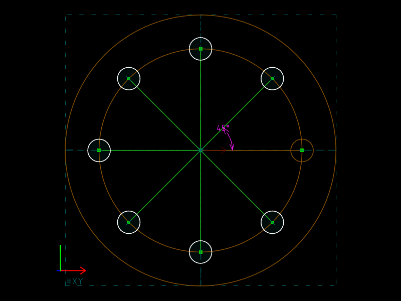
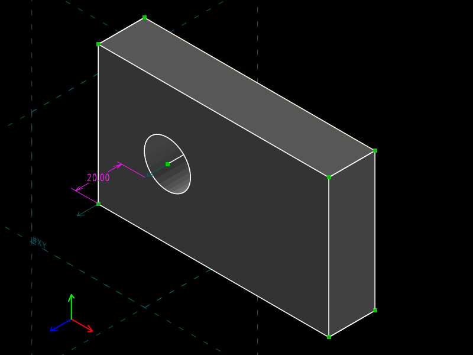
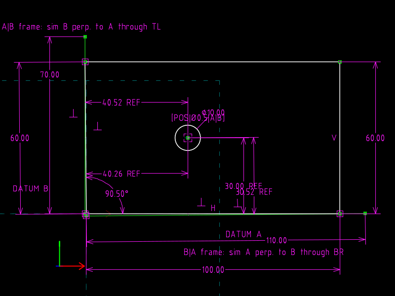
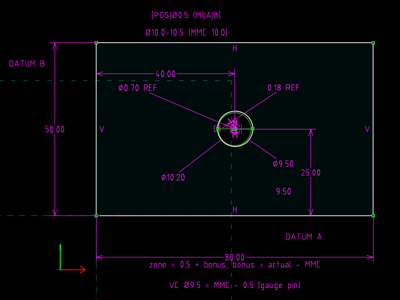
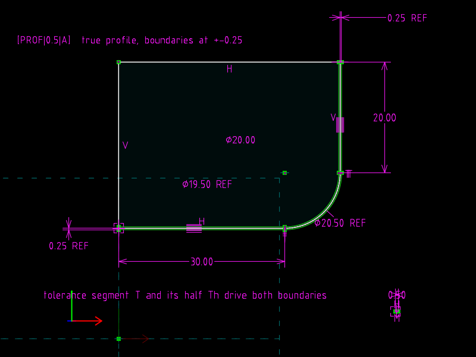
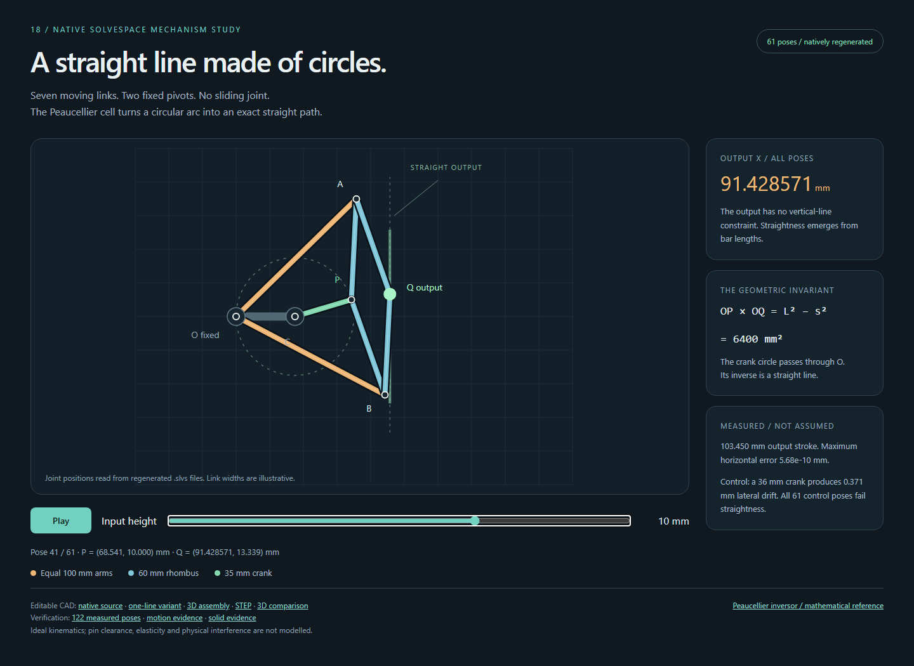
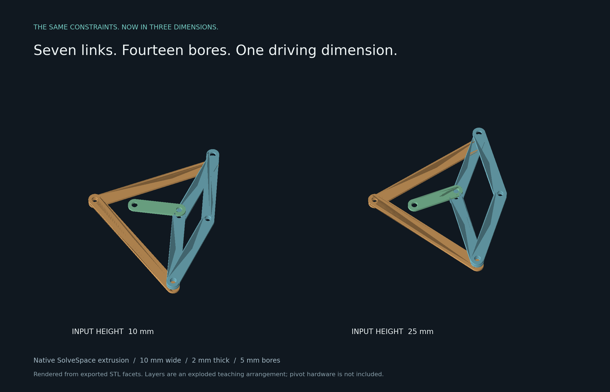
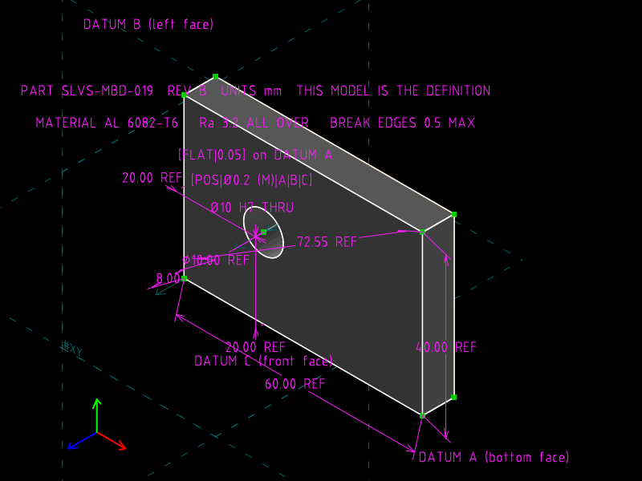
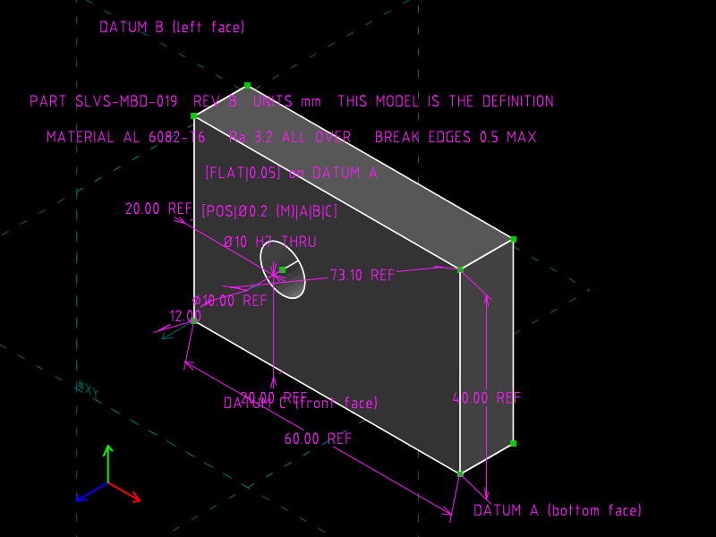

# slvs-beyond-svg-dxf

Minimal working examples of things a SolveSpace `.slvs` file can say
that an SVG or a DXF cannot: relationships instead of coordinates.

SVG and DXF are *evaluated* drawings.  They store where every vertex ended
up, and nothing about why.  A `.slvs` file stores the *problem*: which
points must coincide, which lines are tangent, which distance is 100, and it
stores only rough initial guesses for the coordinates.  SolveSpace's
non-linear constraint solver produces the geometry on load.  Change one
number in the text and the whole drawing re-solves, and the same file can be
exported to SVG, DXF, PDF, STEP and STL from the command line.

Every example is a hand-written `.slvs` file small enough to read in full,
a second file that differs from it by one line, the exports SolveSpace
produced from both, and an automated check that the solved geometry is what
the constraints imply.

## The examples

| | Shows | One-line change | Verified result |
|---|---|---|---|
| [01 Variational triangle](mwe/01_variational_triangle/) | coordinates solved from constraints; a *reference* dimension that reports the measured angle | hypotenuse 125 → 200 | apex (100, 75) → (100, 173.2); 36.87° → 60° written back into the file |
| [02 Tangent slot](mwe/02_tangent_slot/) | tangency, equal radius, construction geometry that drives but does not export | pitch 60 → 90 | four tangent points exactly on their circles; edges horizontal without being told so |
| [03 Symmetric bracket](mwe/03_symmetric_bracket/) | symmetry as a constraint, not a copy; point-on-line | top width 40 → 70 | both top corners move by 15, opposite ways; measured side length rewritten |
| [04 Bolt pattern](mwe/04_bolt_pattern/) | step-and-repeat whose count and pitch angle are model parameters | 6 holes → 8 holes | copies at exact multiples of 45°, all on the pitch circle |
| [05 Transclusion](mwe/05_transclusion/) | a *linked* master file; downstream geometry constrained to it | master pitch 80 → 100, **downstream file byte-identical** | holes move from ±40 to ±50 |
| [06 Sketch to solid](mwe/06_sketch_to_solid/) | the drawing is also a 3D part: STEP B-rep and STL from the same source | thickness 8 → 20 | STL bounding box 100 × 60 × 8 → × 20; STEP with 10 surfaces |

<p align="center">



</p>

## Part II: GD&T principles as verifiable geometry

Geometric dimensioning and tolerancing (ASME Y14.5) is a language of
datums, basic dimensions and tolerance zones.  SolveSpace has **no
tolerance semantics**: no feature control frame, datum symbol or material
condition exists as an object, and a `.slvs` file cannot say "within
0.2".  What it can do is hold the *geometry* those symbols refer to as
constraints: the datum reference frame, the true position from basic
dimensions, the zone boundaries, the MMC bonus rule, the fastener
formulas, the indicator reading.  Seven examples follow Gene Cogorno's
*Geometric Dimensioning and Tolerancing for Mechanical Design* (McGraw-Hill,
2006; ASME Y14.5M-1994) chapter by chapter.  Feature control frames appear
as ASCII text in COMMENT constraints (`[POS|Ø0.5 (M)|A|B]`), because the
built-in vector font has no glyphs for ⌖ ⟂ Ⓜ; the DXF export carries
Unicode comment text verbatim, measured.

| | Book | Shows | One-line change | Verified result |
|---|---|---|---|---|
| [11 Datum precedence](mwe/11_gdt_datum_precedence/) | ch. 3–4 | A\|B and B\|A frames on an out-of-square part; simulators as construction lines | draft 0.5° → 1.0° | the same hole reads (40.52, 30.00) in A\|B and (40.26, 30.52) in B\|A |
| [12 Flatness vs parallelism](mwe/12_gdt_form_flatness/) | ch. 5–6 | measured points (WHERE_DRAGGED); free min-zone vs datum-parallel zone | one point raised | flatness 0.65 < parallelism 0.70, min zone confirmed by brute force |
| [13 Orientation](mwe/13_gdt_orientation/) | ch. 6 | perpendicularity / angularity / parallelism zones at the basic angle | basic angle 90 → 30 → 0 | error 0.349 = 40·sin 0.5° in all three; PARALLEL needed at 0° |
| [14 Position at MMC](mwe/14_gdt_position_mmc/) | ch. 7 | true position from basic dims, zone Ø, **bonus as a LENGTH_DIFFERENCE**, virtual-condition gauge | measured Ø10.2 → 10.0 | zone Ø0.7 → Ø0.5; deviation Ø0.36 accepts both; Ø9.5 pin clears |
| [15 Fasteners](mwe/15_gdt_fasteners/) | ch. 8 | T = H − F and (H − F)/2 built from collinear segments and a midpoint; worst case tangency | H 6.4 → 6.6 | 0.4/0.2 → 0.6/0.3; bolt internally tangent in both |
| [16 Coaxiality, runout, symmetry](mwe/16_gdt_coaxiality_runout/) | ch. 9–11 | eccentric feature: FIM = 2e as a reference LENGTH_DIFFERENCE; slot median vs centre plane | e 0.05 → 0.12; slot 24.03 → 24.08 | runout 0.10 → 0.24; symmetry zone 0.06 → 0.16 |
| [17 Profile](mwe/17_gdt_profile/) | ch. 12 | bilateral zone: offset lines and concentric arcs driven by one tolerance segment | 0.5 → 1.0 | boundaries ±0.25 → ±0.5, arcs Ø20.5/19.5 → Ø21/19 |

<p align="center">



</p>

### Coverage map

| Cogorno chapter | Covered by | Not representable in `.slvs` |
|---|---|---|
| 1–2 Introduction, fundamentals | driving vs reference dimensions in every MWE | units, general tolerances, title-block notes |
| 3 Symbols, terms, rules | COMMENT text FCFs; Rule 1 discussed in 14 | symbols as objects; Rule 1 (perfect form at MMC) as a check |
| 4 Datums | 11 (precedence), datums A/B in 14–16 | datum targets, compound datums as objects |
| 5 Form | 12 (flatness/straightness); circularity by the same construction | free-state variation |
| 6 Orientation | 13 | tangent-plane modifier |
| 7 Position, general | 14 (RFS, MMC, bonus, virtual condition, boundary) | LMC bonus (same construction, other sign), zero positional tolerance (set 0.5 → 0) |
| 8 Position, location | 15 (floating/fixed fasteners), 04 (patterns) | projected zones, composite frames, counterbores |
| 9 Position, coaxiality | 16 | plug-and-socket stacks |
| 10 Concentricity, symmetry | 16 | median-point measurement of lobed forms |
| 11 Runout | 16 (circular) | total runout (needs axial sampling) |
| 12 Profile | 17 | composite profile, coplanarity, conical profile |
| 13 Graphic analysis | 14's zone circles are the paper-gauge overlay | datum shift as a solved fit (no inequality constraints) |
| 14 Tolerancing strategy | 15 | stack-up statistics |

The recurring reason for "not representable" is the same: a solver of
equalities has no inequalities, so "must lie within" can be *drawn* and
*measured* but never *enforced*.

## Part III: From constraints to motion

[18 Peaucellier straight-line linkage](mwe/18_peaucellier/) turns a circular
input into straight output using seven moving links, with **no slider or
straightness constraint on the output**. Change one driving dimension from
10 to 25 mm; then sweep 61 natively regenerated poses over a 103.450 mm
output stroke. A deliberately wrong crank makes the straightness check fail.

[](mwe/18_peaucellier/out/motion.html)

The optional solid version adds seven extruded capsule links and fourteen
bores constrained to the same skeleton. Both poses reopen as seven valid
STEP solids; all seven STL layers are watertight. This is a mechanism study
with exploded link layers, not a manufacturing-ready pivot assembly.



Open the [motion page](mwe/18_peaucellier/out/motion.html) locally to play or
scrub the measured poses. GitHub displays its source; download the repository
and open the file in a browser. See the [example README](mwe/18_peaucellier/README.md)
for the proof, reproduction commands and numerical evidence.

## Part IV: Model-based definition and PMI

[19 MBD and PMI](mwe/19_mbd_pmi/): one `.slvs` file is the released
definition of a plate. It holds the driving dimensions, 3D dimensions and
notes anchored to model points, datum labels, a feature control frame,
material, finish and revision. The CLI derives four views, DXF, STEP and
STL from it, and `tools/pmi.py` reads the PMI back out as JSON. Change
the thickness in one line: every view, the solid, the anchored hole
callout and the PMI report follow, and the check proves the 3D reference
PMI can never disagree with the model. Measured limit: the STEP export is
AP203 geometry with zero PMI entities; semantic PMI in AP242 is outside
SolveSpace.

<p align="center">


</p>

## Capability matrix

| Capability | SVG | DXF | `.slvs` | MWE |
|---|---|---|---|---|
| Coordinates computed from relationships | – | – | ✓ non-linear solver | 01 |
| Driving dimension (edit a number, geometry follows) | – | – | ✓ `Constraint.valA` | all |
| Driven / reference dimension (measured, written back) | – | text override only | ✓ `Constraint.reference=1` | 01, 03 |
| Tangency, perpendicularity, equal radius, symmetry, midpoint, point-on-curve | – | – | ✓ ~40 constraint types | 02, 03 |
| Construction geometry (drives, does not export) | – | layer convention | ✓ `Request.construction=1` | 02, 03, 04 |
| Pattern with parametric count and pitch | `<use>` copies | `INSERT` copies | ✓ ROTATE / TRANSLATE groups, copies still constrainable | 04 |
| External reference that local geometry can constrain to | `<use href>` displays only | `XREF` displays only | ✓ LINKED group + constraints to linked entities | 05 |
| Same source drives 2D drawing and 3D solid | – | – | ✓ EXTRUDE / LATHE / REVOLVE groups; STEP, STL | 06 |
| Dimensions exported as real dimension entities | – | ✓ as input | ✓ writes DXF `DIMENSION` | 01 |
| Exact arcs preserved on export | arc commands | `ARC` | ✓ exports both | 02 |
| Human-readable, line-diffable text | ✓ | ✓ | ✓ | all |

What `.slvs` does **not** give you, so you are not oversold: there are no
named variables or expressions in the file (a dimension is a literal number;
relations between dimensions are constraints such as `EQUAL_LENGTH_LINES`,
`LENGTH_RATIO`, `LENGTH_DIFFERENCE`); no units (millimetres are implied); no
layers beyond styles; text only as TTF outlines; and the solver is numeric,
so results carry ~1e-8 relative error rather than being exact.

Four constraint types carry most of Part II and deserve to be known by
name: `200` WHERE_DRAGGED pins a point to the coordinates in the file
(measured data), `56` LENGTH_DIFFERENCE and `51` LENGTH_RATIO relate two
lengths (and can be *reference*, so the file reports a difference), `52`
EQ_LEN_PT_LINE_D makes a point's distance from a line equal to another
line's length (offsets driven by a segment), and `1000` COMMENT is text.

## Quick start

You need `solvespace-cli`, the headless SolveSpace binary, and Python 3.9+
(standard library only).

```
python tools/build.py --cli /path/to/solvespace-cli    # regenerate + export into mwe/*/out/
python tools/check.py                                  # assert the solved geometry
python -m unittest discover -s tests                   # offline tests of the tools
```

`build.py` also honours `$SOLVESPACE_CLI` and `PATH`.  Use `--only 05` to
build one example, `-v` to see every CLI call.

### Getting `solvespace-cli`

- **Linux:** distribution packages of SolveSpace include it (`solvespace-cli`
  on Debian/Ubuntu/Fedora/Arch); the Flatpak exposes it as
  `flatpak run --command=solvespace-cli com.solvespace.SolveSpace`.
- **macOS:** inside the app bundle, `SolveSpace.app/Contents/MacOS/solvespace-cli`.
- **Windows:** the official release does **not** ship it (the CI builds it and
  discards it; see upstream issue
  [#1770](https://github.com/solvespace/solvespace/issues/1770) and PR
  [#1771](https://github.com/solvespace/solvespace/pull/1771)).  Build from
  source with CMake + MSVC, or download the `solvespace-cli.exe` artifact of a
  CI run.  WinGet, Scoop and Chocolatey deliver the GUI only.
- **Any platform:** `git clone --recursive https://github.com/solvespace/solvespace`,
  then `cmake -B build && cmake --build build`; the CLI is `build/bin/solvespace-cli`.

The GUI binary has no export flags on any platform; a trailing argument is
a file to open.

## Reading a `.slvs` file

A ten-minute primer is in [`docs/slvs-primer.md`](docs/slvs-primer.md): the
magic bytes, the record grammar, how handles encode request → entity →
parameter, why the sources here contain no `Entity` records, and how
derived entities (pattern copies, linked entities, extruded copies) get
their handles from `Group.remap`.

Three traps that cost time, recorded so you do not pay for them again:

1. The file starts with **raw bytes `B1 B2 B3`**, not UTF-8.  An editor that
   re-saves as UTF-8 breaks the file.  `python tools/slvs.py check` detects
   it and `fix` repairs it.
2. The CLI's `--output` pattern must be a bare `%.svg`.  `%` expands to the
   input path *including its directory*, so `out/%.svg` writes to
   `out/out/name.svg` and fails, while still printing `Written '…'` and
   exiting 0.
3. A linked file is read at the **entity** level, so after editing a master
   you must `regenerate` the master before anything that links it.
4. Equal equation and unknown counts are not enough.  A redundant
   constraint makes SolveSpace refuse the group; a *degenerate* one (a
   line meeting a circle at a double root) makes the solver stall at the
   initial guess with exit code 0.  MWE 17 records one of each.
5. `thumbnail` draws SolveSpace's "not closed contour" warning into the
   PNG when the setting is on; close your outlines or make the extra
   geometry construction.  Comment labels are centred on `disp.offset`.

## Layout

```
mwe/NN_name/           one example: hand-written .slvs source(s), a one-line variant,
  README.md            what it shows, the file explained, the diff, verified numbers
  build.json           regenerate order, view, exports
  check.py             geometry assertions for this example, with a negative control
  out/                 what solvespace-cli produced (svg/png committed; dxf/step/stl/slvs regenerated)
tools/slvs.py          byte-safe .slvs reader; magic-byte checker/fixer
tools/build.py         runs the CLI for every example (extra "views" and "pmi" per build.json)
tools/check.py         runs every mwe/*/check.py
tools/pmi.py           extracts dimensions, notes and datums from a regenerated .slvs as JSON
tests/                 offline unit tests for the tools
docs/slvs-primer.md    the format, cited to SolveSpace source lines
docs/provenance.md     where this came from, and which claims of the seed were wrong
```

## Provenance

This repository started as a fact-check.  An LLM conversation described
`.slvs` as "The Variational Text Standard" and gave a fluent, plausible and
largely fabricated description of the format, the CLI, and the Python
bindings.  The capabilities it claimed are real; the details it invented are
listed with corrections in [`docs/provenance.md`](docs/provenance.md).  Every
statement in this repository about the format is cited to a file and line
in the SolveSpace source or measured with the CLI (version `3.2~8f4b12ca`,
master as of 2026-09).

## Licence

[CC BY-SA 4.0](LICENSE).  Copyright © 2026 Foad S. Farimani and
contributors.  Initial version drafted with Claude (Anthropic) and verified
against SolveSpace by running the binary; SolveSpace itself is GPLv3 and is
not included here.
