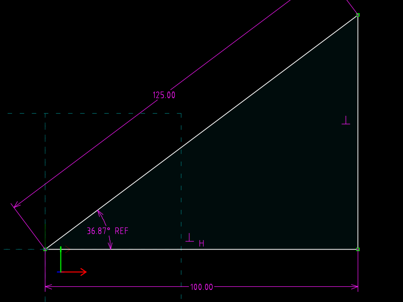
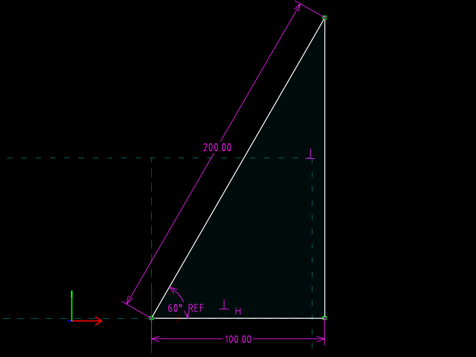

# 01 · Variational triangle

**What SVG/DXF cannot do:** state *relationships* and let the coordinates be
computed.  Here no vertex coordinate is given.  The file says "a horizontal
base of 100, a perpendicular side, a hypotenuse of 125" and the solver finds
the apex.  Change the hypotenuse to 200 in one line and the apex moves.

| `triangle.slvs` (hypotenuse 125) | `triangle.hyp200.slvs` (hypotenuse 200) |
|---|---|
|  |  |

The magenta annotations are the constraints themselves, exported as
dimensions.  `60° REF` is a *reference* dimension: it reports the measured
angle; it does not drive anything.

## The file

Two groups (the mandatory `#references` group and one sketch group in the
XY plane), three line-segment requests, and nine constraints.

| Request | Entity | Points | Role |
|---|---|---|---|
| `00000004` `type=200` | `00040000` | `00040001` A, `00040002` B | base |
| `00000005` | `00050000` | `00050001` B', `00050002` C | side |
| `00000006` | `00060000` | `00060001` C', `00060002` A' | hypotenuse |

The `Param` records (`0004001x`, `0005001x`, `0006001x`) hold **initial
guesses**, not results: A at (0,0), B at (10,0), C at (10,10).  SolveSpace
reads them as the starting point for the solve and writes the solved values
back.

| Constraint | Type | Meaning |
|---|---|---|
| 1 | `20` POINTS_COINCIDENT | A = workplane origin (`00010001`) |
| 2–4 | `20` | B = B', C = C', A' = A (closes the loop) |
| 5 | `80` HORIZONTAL | base is horizontal |
| 6 | `122` PERPENDICULAR | base ⟂ side |
| 7 | `30` PT_PT_DISTANCE `valA=100` | base length (driving) |
| 8 | `30` PT_PT_DISTANCE `valA=125` | hypotenuse length (driving) |
| 9 | `120` ANGLE `reference=1` | angle at A, **measured** and written back |

Twelve unknowns (six 2D points), twelve equations: fully constrained.

## The one-line change

```diff
--- triangle.slvs
+++ triangle.hyp200.slvs
-Constraint.valA=125.00000000000000000000
+Constraint.valA=200.00000000000000000000
```

## Verified

`solvespace-cli regenerate` writes the solved state back into the file.
`tools/check.py` reads it:

| file | apex `00050002` | reference angle written to constraint 9 |
|---|---|---|
| `triangle.slvs` | (100, 75) | 36.8699° |
| `triangle.hyp200.slvs` | (100, 173.205) | 60.0000° |

The source files still contain the guess (10, 10); only the regenerated
copies in `out/` contain the answer.

## What the SVG has instead

```
<path d='M16.300 95.100 L116.300,95.100 L116.300,20.100 L16.300,95.100  Z' class='s1' />
```

Three evaluated vertices, offset by the drawing's bounding box.  Neither
`100`, `125` nor `90°` appears anywhere in the SVG or the DXF; the numbers
that do appear are consequences, and nothing records how they were produced.
To make the hypotenuse 200 you would recompute every vertex yourself.

## Commands

```
solvespace-cli regenerate out/triangle.slvs
solvespace-cli export-view --view front --output %.svg out/triangle.slvs
solvespace-cli export-view --view front --output %.dxf out/triangle.slvs
solvespace-cli thumbnail   --view front --size 800x600 --output %.png out/triangle.slvs
```
