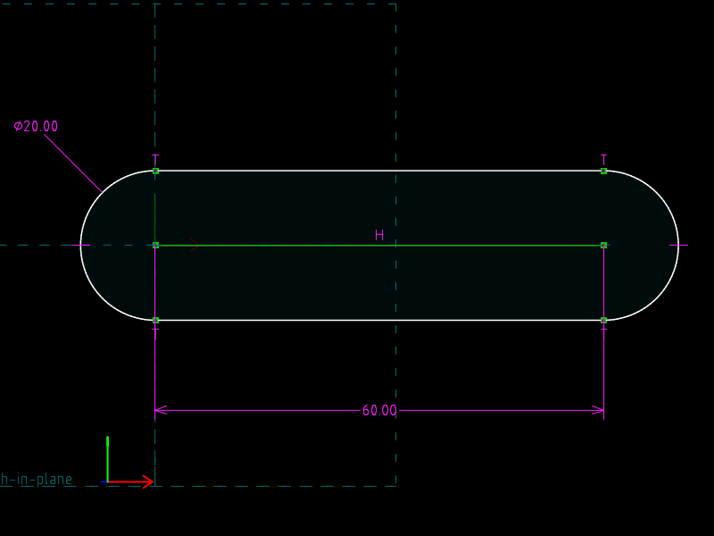
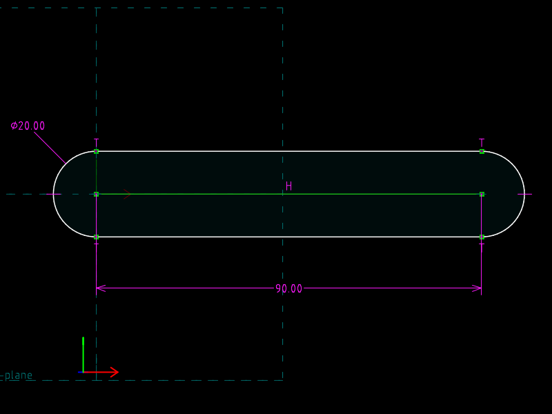

# 02 · Tangent slot

**What SVG/DXF cannot do:** tangency, equal radius, and a driving pitch.
An obround slot is two arcs and two straight edges.  The straight edges are
never told to be horizontal, and their endpoints are never given: they are
*tangent* to both arcs, and that is enough.  Change the centre distance from
60 to 90 and the edges stretch, still tangent.

| `slot.slvs` (pitch 60) | `slot.pitch90.slvs` (pitch 90) |
|---|---|
|  |  |

The green horizontal line is a *construction* line: it carries the pitch
dimension and is not exported (the DXF contains exactly 2 `LINE` entities).

## The file

| Request | Type | Entity | Points | Role |
|---|---|---|---|---|
| `00000004` | `500` ARC_OF_CIRCLE | `00040000` | centre `…01`, start `…02`, end `…03` | left arc |
| `00000005` | `500` | `00050000` | centre, start, end | right arc |
| `00000006` | `200` LINE_SEGMENT | `00060000` | `…01`, `…02` | top edge |
| `00000007` | `200` | `00070000` | `…01`, `…02` | bottom edge |
| `00000008` | `200`, `construction=1` | `00080000` | `…01`, `…02` | pitch line |

Arcs run counter-clockwise from start to end about the workplane normal, so
the left arc goes from (0, 10) over the left side to (0, −10).

| Constraint | Type | Meaning |
|---|---|---|
| 1 | `20` | left centre = origin |
| 2, 3 | `20` | pitch-line ends = the two arc centres |
| 4 | `80` HORIZONTAL | pitch line horizontal |
| 5 | `30` PT_PT_DISTANCE `valA=60` | **pitch** (driving) |
| 6 | `90` DIAMETER `valA=20` | left arc diameter |
| 7 | `130` EQUAL_RADIUS | right arc = left arc |
| 8–b | `20` | edge endpoints coincide with arc endpoints |
| c–f | `123` ARC_LINE_TANGENT | each edge tangent to each arc |

`Constraint.other=1` on a tangency selects the arc's *end* point rather than
its start (`src/constrainteq.cpp`).  An arc also contributes one implicit
equation of its own: start and end are equidistant from the centre
(`Entity::GenerateEquations`).  24 unknowns, 24 equations.

## The one-line change

```diff
-Constraint.valA=60.00000000000000000000
+Constraint.valA=90.00000000000000000000
```

## Verified

| file | arc centres | tangent points (all four) | edge length |
|---|---|---|---|
| `slot.slvs` | (0,0) and (60,0) | y = ±10 exactly, on their circles | 60 |
| `slot.pitch90.slvs` | (0,0) and (90,0) | y = ±10 exactly, on their circles | 90 |

Both straight edges came out horizontal with no HORIZONTAL constraint on
them: tangency to two equal circles on a horizontal pitch line implies it.

## What SVG/DXF have instead

An SVG `<path>` with `A` arc commands, or a DXF `ARC` with a start and end
angle.  The tangent point has to be computed by whoever writes the file, and
once written, nothing in the file knows that the arc and the line touch.
Move the arc and the line stays where it was.
