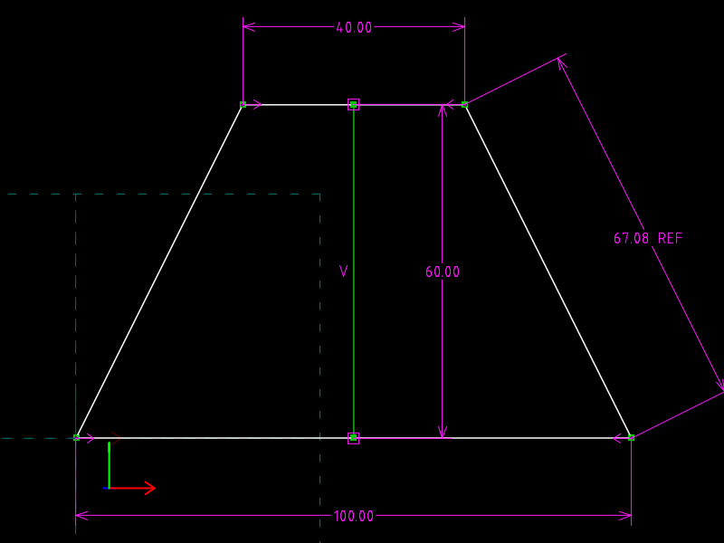
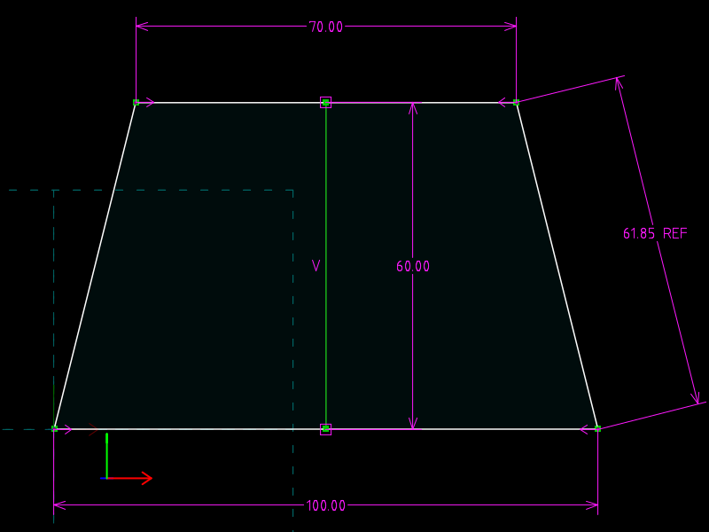

# 03 · Symmetric bracket

**What SVG/DXF cannot do:** symmetry as a *constraint* rather than a copy,
and a dimension that reports instead of drives.  A trapezoid is mirrored
about a construction centreline.  Widen the top from 40 to 70 and both top
corners move, in opposite directions, by 15.  The slanted side's length is a
reference dimension: SolveSpace measures it and writes the value into the
file.

| `bracket.slvs` (top 40) | `bracket.top70.slvs` (top 70) |
|---|---|
|  |  |

## The file

| Request | Entity | Role |
|---|---|---|
| `00000004` | `00040000` | bottom edge, BL `00040001` → BR `00040002` |
| `00000005` | `00050000` | right side, BR' → TR `00050002` |
| `00000006` | `00060000` | top edge, TR' → TL `00060002` |
| `00000007` | `00070000` | left side, TL' → BL' |
| `00000008` (construction) | `00080000` | centreline, `00080001` bottom → `00080002` top |

| Constraint | Type | Meaning |
|---|---|---|
| 1 | `20` | BL = origin |
| 2–5 | `20` | close the loop |
| 6 | `81` VERTICAL | centreline vertical |
| 7, 8 | `42` PT_ON_LINE | centreline ends lie on the bottom and top edges |
| 9 | `63` SYMMETRIC_LINE | BL and BR mirrored about the centreline |
| a | `63` SYMMETRIC_LINE | TL and TR mirrored about the centreline |
| b | `30` `valA=100` | bottom width (driving) |
| c | `30` `valA=40` | **top width** (driving) |
| d | `30` `valA=60` | height, as the centreline's length (driving) |
| e | `30` `reference=1` | slanted side length, **measured** |

Note what is *not* there: no HORIZONTAL on the bottom edge (mirroring about
a vertical line implies it) and no EQUAL_LENGTH on the two sides (the
symmetry implies that too).  20 unknowns, 20 equations.

## The one-line change

```diff
-Constraint.valA=40.00000000000000000000
+Constraint.valA=70.00000000000000000000
```

## Verified

| file | TL | TR | side length written to constraint e |
|---|---|---|---|
| `bracket.slvs` | (30, 60) | (70, 60) | 67.0820 = √(30² + 60²) |
| `bracket.top70.slvs` | (15, 60) | (85, 60) | 61.8466 = √(15² + 60²) |

## What SVG/DXF have instead

SVG can *draw* a mirrored copy (`<use transform="scale(-1,1)">`), but that
mirrors a picture; it does not say "these two points stay mirrored when
either moves".  Neither format has any notion of a dimension that is a
measurement: a DXF `DIMENSION` with a text override is a label you typed.
