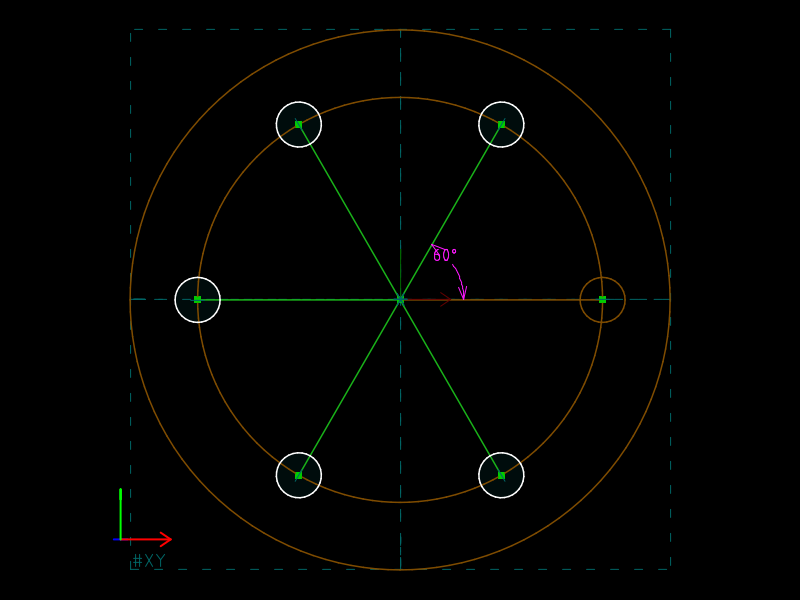

# 04 · Bolt pattern (step and repeat)

**What SVG/DXF cannot do:** a pattern whose *count* and *pitch* are
parameters of the model, with each copy still constrained to the geometry
it was derived from.  Six holes on a 90 mm pitch circle become eight by
editing two numbers: the number of copies and the angle between neighbours.

| `flange.slvs` (5 copies + seed = 6 holes) | `flange.8holes.slvs` (7 + 1 = 8 holes) |
|---|---|
|  |  |

## The file

Four groups.  The seed hole must live in its own group because a step-and-
repeat copies *every* entity of its source group (`src/group.cpp`, the
`ROTATE` case), and we do not want six copies of the outer circle.

| Group | Type | Contents |
|---|---|---|
| `00000002` `flange` | `5001` sketch | outer circle Ø120 (`00040000`), construction pitch circle Ø90 (`00050000`) |
| `00000003` `hole-seed` | `5001` sketch | hole Ø10 (`00060000`), construction spoke from origin to hole centre (`00070000`) |
| `00000004` `bolt-pattern` | `5200` ROTATE | `opA=3`, `valA=5` copies, `skipFirst=1`, axis = the workplane normal `80030001` through the origin |

`skipFirst=1` is what the GUI sets: copy 0 would coincide with the seed.
The hole's centre is constrained onto the pitch circle with `100`
PT_ON_CIRCLE, and the spoke is HORIZONTAL so the seed sits at 0°.

The angle between copies is a **constraint in the rotate group**:

```
Constraint.type=120            ANGLE
Constraint.group.v=00000004
Constraint.valA=60
Constraint.entityA.v=00070000  the seed's spoke
Constraint.entityB.v=80040005  the spoke in copy 1
```

`80040005` is a *derived* entity.  Its handle comes from the group's remap
table: `Group.remap` maps (source entity, copy number) → index, and the
derived handle is `0x80000000 | group<<16 | index` (`src/sketch.h`,
`hGroup::entity`).  The table is filled in insertion order on the first
regenerate (`Group::Remap`), so it is deterministic and the source file can
leave it empty; the regenerated copy in `out/` shows it filled.

Two facts worth knowing about the stored rotation parameter `80040003`:
it is solved (0.25 in the source, 0.2618 after regenerate), and its value is
the per-copy angle **divided by four**, in radians.  The reason is in the
source: a rotated point applies `param × timesApplied × 2`
(`src/entity.cpp`, `POINT_N_ROT_AA`), and a one-sided pattern hands copy
*a* a `timesApplied` of `2a` (`src/group.cpp`, `ROTATE`).  Solver-internal;
the readable number is the 60 in the constraint.

## The two-line change

```diff
-Group.valA=5.00000000000000000000
+Group.valA=7.00000000000000000000
 ...
-Constraint.valA=60.00000000000000000000
+Constraint.valA=45.00000000000000000000
```

## Verified

| file | derived hole circles | angles of their centres | radius of every centre |
|---|---|---|---|
| `flange.slvs` | 5 | 60, 120, 180, 240, 300 | 45 |
| `flange.8holes.slvs` | 7 | 45, 90, … 315 (within 1e-4°) | 45 |

## What SVG/DXF have instead

SVG has `<use>` with a `rotate()` transform and DXF has `INSERT` of a
`BLOCK`; both can place copies.  Neither can say "the copy's spoke makes 60°
with the original's" or "the seed lies on that construction circle", and
neither re-places the copies when the pitch circle's diameter changes.
