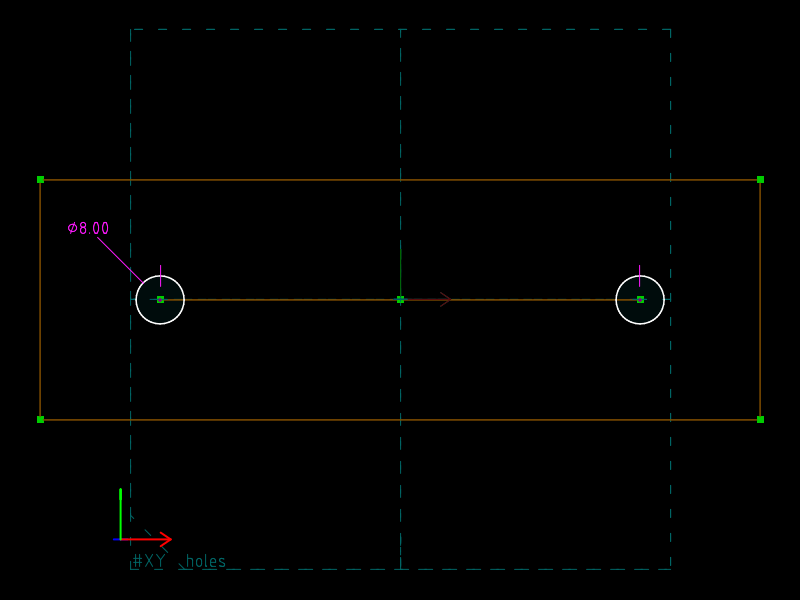
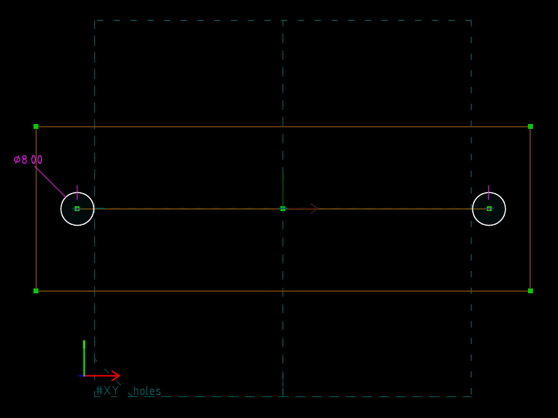

# 05 · Transclusion (master model / skeleton)

**What SVG/DXF cannot do:** reference geometry that lives in *another file*
and follow it when that file changes.  `skeleton.slvs` holds one construction
line whose length is the hole pitch.  `bracket.slvs` links it, pins it to its
own origin, and constrains two holes onto the line's endpoints.

`base/bracket.slvs` and `variant/bracket.slvs` are **byte-identical**
(`tools/check.py` asserts it).  Only the skeleton differs.  The holes move.

| `base/` (skeleton pitch 80) | `variant/` (skeleton pitch 100) |
|---|---|
|  |  |

## The master: `skeleton.slvs`

One construction line, `00040000`, with two constraints: its endpoints are
`61` SYMMETRIC_HORIZ (mirrored about the workplane's vertical axis, so the
line is centred on the origin and horizontal) and `30` PT_PT_DISTANCE
`valA=80`.  It exports nothing visible on its own.

## The downstream: `bracket.slvs`

| Group | Type | Contents |
|---|---|---|
| `00000002` `plate` | `5001` sketch | 120 × 40 rectangle centred on the origin by SYMMETRIC_HORIZ / SYMMETRIC_VERT |
| `00000003` `skeleton` | **`5300` LINKED** | `Group.impFileRel=skeleton.slvs`, `meshCombine=2` (assemble) |
| `00000004` `holes` | `5001` sketch | two Ø8 circles |

The linked group brings the skeleton's entities in under new handles,
again through `Group.remap`: the skeleton's origin point `00010001` becomes
`80030002`, its XY normal `00010020` becomes `80030003`, and the line's
endpoints `00040001` / `00040002` become `8003000b` / `8003000c`.

A linked group is a rigid body with seven free parameters (`80030000`–
`80030006`: translation and a quaternion).  Two constraints in the linked
group fix it; two in the `holes` group use it:

| Constraint | Group | Type | Meaning |
|---|---|---|---|
| a | 3 | `20` POINTS_COINCIDENT | linked origin `80030002` = local origin `00010001` |
| c | 3 | `110` SAME_ORIENTATION | linked XY normal `80030003` ∥ local `00010020` |
| d, e | 4 | `20` | hole centres on the linked line's endpoints |
| f, b | 4 | `130` EQUAL_RADIUS, `90` DIAMETER 8 | hole size |

Without a and c the solver could satisfy d and e by moving the skeleton
instead of the holes; pinning the link makes the intent unambiguous.

## What changes

```diff
--- base/skeleton.slvs
+++ variant/skeleton.slvs
-Constraint.valA=80.00000000000000000000
+Constraint.valA=100.00000000000000000000
```

```
$ cmp base/bracket.slvs variant/bracket.slvs && echo identical
identical
```

## Verified

| | hole centres in `bracket.slvs` | linked origin |
|---|---|---|
| `base/` | (−40, 0), (40, 0) | (0, 0, 0) |
| `variant/` | (−50, 0), (50, 0) | (0, 0, 0) |

## Order matters

A link is read at the **entity** level: `ReloadAllLinked` in
`src/file.cpp` loads the linked file's `Entity` records and their solved
`actPoint` values, not its requests and constraints.  So after editing the
skeleton you must regenerate the skeleton *before* the bracket:

```
solvespace-cli regenerate skeleton.slvs     # solves, writes entities
solvespace-cli regenerate bracket.slvs      # re-reads skeleton's entities
```

`tools/build.py` does this in the order given in `build.json`.  This is
exactly the dependency a `Makefile` would express: `bracket.svg: bracket.slvs
skeleton.slvs`.

## What SVG/DXF have instead

SVG `<use href="other.svg#id">` and DXF `XREF` can *display* external
content, and that is the whole relationship: nothing local can be
constrained to a point inside the reference.
