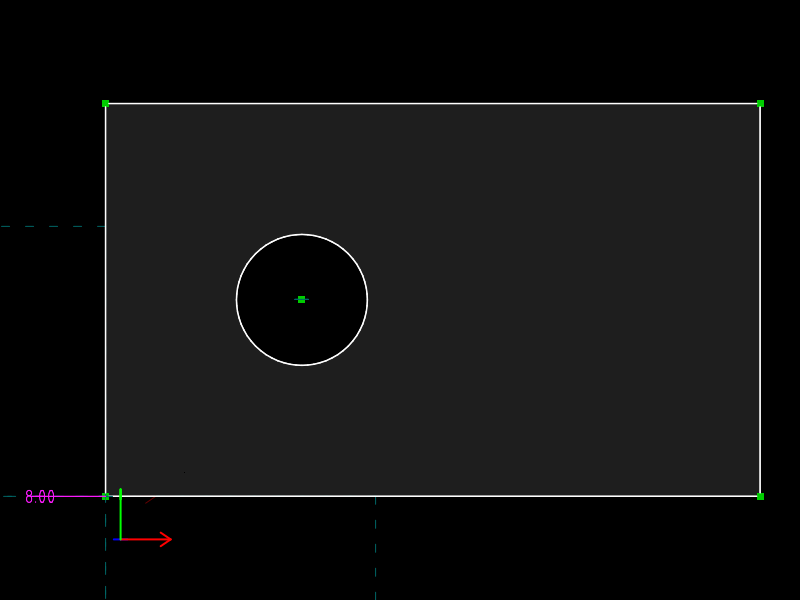
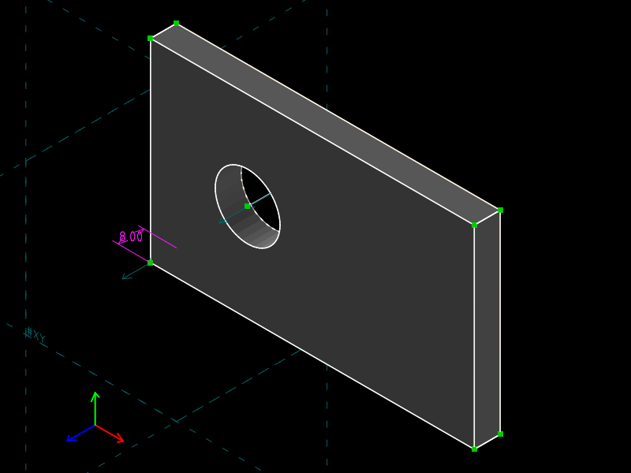

# 06 · Sketch to solid

**What SVG/DXF cannot do:** be the *source* of a 3D part.  The same file
that exports a dimensioned 2D drawing also exports a STEP B-rep and an STL
mesh.  The plate's thickness is a constraint like any other; change 8 to 20
and the solid follows.

| 2D drawing (`export-view`) | Solid, depth 8 | Solid, depth 20 |
|---|---|---|
|  |  |  |

## The file

| Group | Type | Contents |
|---|---|---|
| `00000002` `plate-sketch` | `5001` sketch | 100 × 60 rectangle + Ø20 hole |
| `00000003` `extrude` | **`5100` EXTRUDE** | `opA=2`, `subtype=7000` ONE_SIDED, `predef.entityB=80020000` (the sketch's workplane) |

The hole is a plain circle inside the rectangle: SolveSpace treats nested
contours as holes when it extrudes, so no boolean is needed.

The hole is positioned by two `32` PT_LINE_DISTANCE constraints from the
bottom and left edges.  **Their `valA` is −30.**  In a workplane this
distance is signed; the sign selects the side of the line, relative to the
line's direction (`src/constrainteq.cpp`, `PointLineDistance`).  With the
outline drawn counter-clockwise, "inside" is negative.  The GUI shows the
magnitude and stores the sign.

The depth is a distance constraint between a sketch corner and its
extruded copy:

```
Constraint.type=30
Constraint.group.v=00000003     lives in the extrude group
Constraint.valA=8
Constraint.ptA.v=00040001       the origin corner in the sketch
Constraint.ptB.v=80030005       its top copy: remap index 5 = (00040001, REMAP_TOP)
```

No `Constraint.workplane`: this one is in 3D.  As in MWE 04, `80030005` is a
derived handle from the group's remap table (`REMAP_TOP = 1001`,
`src/sketch.h`).

The extrusion vector parameters `80030000`–`80030002` are solved.  Their
solved value is **half** the depth (4 for a depth of 8): a one-sided
extrude places the top copy at twice the vector (`src/group.cpp`, `af = 2`
in the `EXTRUDE` case).  Solver-internal; the readable number is the
constraint.

## The one-line change

```diff
-Constraint.valA=8.00000000000000000000
+Constraint.valA=20.00000000000000000000
```

## Verified

| file | hole centre | STL bounding box | STEP |
|---|---|---|---|
| `plate.slvs` | (30, 30) | 100 × 60 × 8 | ISO 10303-21, 10 `B_SPLINE_SURFACE_WITH_KNOTS` |
| `plate.depth20.slvs` | (30, 30) | 100 × 60 × 20 | same topology |

SolveSpace's kernel is NURBS-only: planes and cylinders are written to STEP
as (rational) B-spline surfaces, which is exact, not as `PLANE` /
`CYLINDRICAL_SURFACE` entities.

## Commands

```
solvespace-cli regenerate       out/plate.slvs
solvespace-cli export-view      --view front     --output %.svg  out/plate.slvs
solvespace-cli export-surfaces  --output %.step  out/plate.slvs
solvespace-cli export-mesh      --chord-tol 0.1 --output %.stl out/plate.slvs
solvespace-cli thumbnail        --view isometric --size 800x600 --output %.iso.png out/plate.slvs
```

## What SVG/DXF have instead

A 2D outline.  Anything three-dimensional made from it is a separate
artefact in a separate tool, with its own copy of the numbers.
