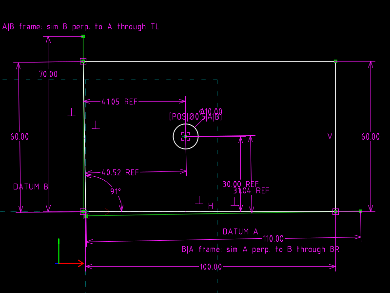

# 11 · Datum precedence (A|B is not B|A)

**GD&T says** (Cogorno ch. 4 *Datums*, ch. 3 *datum reference frame*): a
feature control frame names datums in order.  The primary datum makes full
contact with its simulator; the secondary simulator is held perpendicular
to the primary and touches its feature only at the high point.  A real part
is never square, so `A|B` and `B|A` are two different coordinate systems.

**The file models** a plate whose left face leans out by 0.5°, a hole
measured at (40, 30) in the part's own corner, and both simulator sets as
construction lines.  Four reference dimensions report the hole in each
frame.  The numbers disagree by half a millimetre, which is the whole
lesson.

| `plate.slvs` (0.5° out of square) | `plate.skew1.slvs` (1.0°) |
|---|---|
|  |  |

## The file

| Request | Role |
|---|---|
| `r4` bottom edge BL→BR | datum feature A: at origin, HORIZONTAL, 100 long |
| `r7` left edge BL→TL | datum feature B: 60 long, ANGLE to the bottom edge = **90.5°** |
| `r5`, `r6` | right edge (VERTICAL, 60) and top edge; loop closed by coincidences |
| `r8` circle Ø10 | the hole; centre pinned by WHERE_DRAGGED at the *measured* (40, 30) |
| `r9` construction `simB` | A\|B: PERPENDICULAR to A, passes through TL (PT_ON_LINE), starts on A |
| `r10` construction `simA` | B\|A: PERPENDICULAR to the left edge, passes through BR, starts on B |

TL is the point of the leaning face that protrudes furthest, so the
secondary simulator of `A|B` touches there.  For `B|A`, the bottom face's
lowest point *along B* is BR, so the secondary simulator of that frame
touches there.  Choosing the contact point is what a datum simulator does;
here it is chosen by hand and stated.

| Constraint | Type | Reports |
|---|---|---|
| `16` | `32` PT_LINE_DISTANCE, reference | hole to A (A\|B y) |
| `17` | `32`, reference | hole to `simB` (A\|B x) |
| `18` | `32`, reference | hole to the left edge (B\|A x) |
| `19` | `32`, reference | hole to `simA` (B\|A y) |

## The one-line change

```diff
-Constraint.valA=90.50000000000000000000
+Constraint.valA=91.00000000000000000000
```

## Verified

With θ the angle between bottom and left edge, TL = 60·(cos θ, sin θ),
b = (cos θ, sin θ):

| | A\|B: (40 − TL.x, 30) | B\|A: (\|40 sin θ − 30 cos θ\|, \|(40−100) cos θ + 30 sin θ\|) |
|---|---|---|
| θ = 90.5° | (40.524, 30.000) | (40.260, 30.522) |
| θ = 91.0° | (41.047, 30.000) | (40.518, 31.043) |

`check.py` recomputes these from the solved angle and compares them with
the four reference values written into `out/*.slvs`.

## What the file cannot say

There is no datum-feature symbol, no feature control frame object and no
tolerance zone in SolveSpace; `[POS|Ø0.5|A|B]` is a COMMENT.  The
simulators are ordinary construction lines whose contact points the author
chose.  What the format *does* give you is the arithmetic: change the
out-of-squareness and every reported coordinate re-solves.
