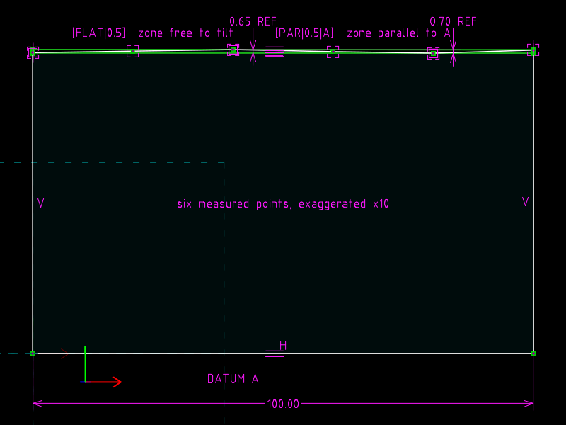
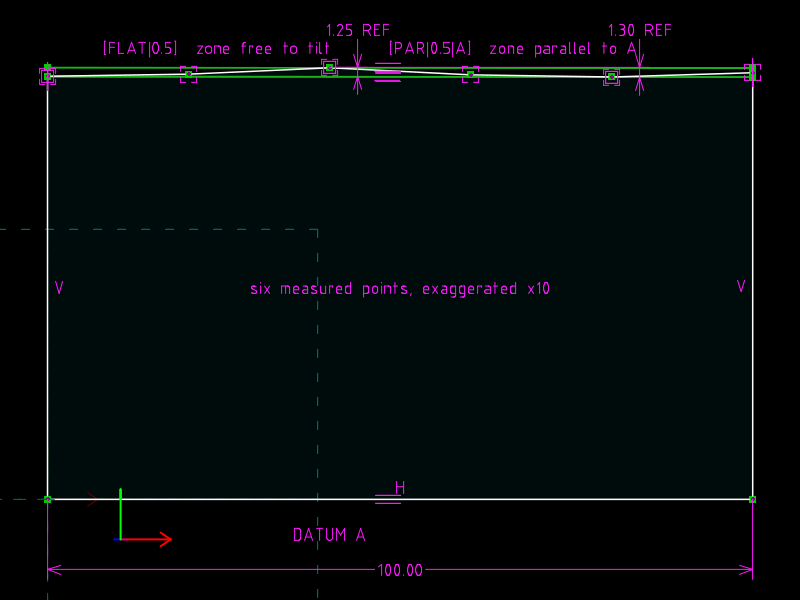

# 12 · Form: flatness versus parallelism

**GD&T says** (Cogorno ch. 5 *Form*, ch. 6 *Orientation*): a flatness
zone is two parallel planes a tolerance apart, free to take *any*
orientation; the surface must lie between them.  Parallelism uses the same
two planes but they must be parallel to a datum.  So for the same surface
the flatness value can never exceed the parallelism value.

**The file models** six measured points on a "flat" face (deviations
exaggerated ×10 so they are visible), the minimum-width free zone, and the
datum-parallel zone, each reporting its width as a reference dimension.

| `surface.slvs` | `surface.bump.slvs` (peak raised) |
|---|---|
|  |  |

## The file

| Request | Role |
|---|---|
| `r4` bottom edge | datum feature A, HORIZONTAL, 100 long |
| `r5`…`r10` DATUM_POINT | the measured surface: (0, 60.0) (20, 60.3) (40, 60.6) (60, 60.2) (80, 59.9) (100, 60.5), each pinned by `200` WHERE_DRAGGED |
| `r11`…`r15` | polyline through the points, and `r20`, `r21` the sides, so the outline is closed |
| `r16` `Z1`, `r17` `Z2` (construction) | **flatness zone**: `Z1` through points 0 and 4 (`42` PT_ON_LINE ×2), `Z2` PARALLEL to `Z1` through point 2 |
| `r18` `P1`, `r19` `P2` (construction) | **parallelism zone**: both PARALLEL to A, through the highest and the lowest point |
| `1c` | `32` PT_LINE_DISTANCE, reference: point 2 to `Z1` = **flatness** |
| `25` | `32`, reference: point 2 to `P2` = **parallelism** |

WHERE_DRAGGED is the right constraint for measured data: it pins a point
to whatever coordinates the `Param` records hold, so the data *are* the
initial guesses and nothing else in the file restates them.

The two points that carry `Z1` (0 and 4) and the one that carries `Z2`
(2) are the minimum-zone contacts.  They were found by brute force in
Python before the file was written, and `check.py` recomputes the minimum
zone from the solved points on every run, so if you change the data and
the contacts move, the check tells you.

## The one-line change

```diff
-Param.val=60.60000000000000000000
+Param.val=61.20000000000000000000
```

## Verified

| | flatness (free zone) | parallelism to A |
|---|---|---|
| `surface.slvs` | 0.65 | 0.70 |
| `surface.bump.slvs` | 1.25 | 1.30 |

The flatness zone tilts (slope −0.00125) to hug the data; the parallelism
zone may not, and pays 0.05 for it.  Against `[FLAT|0.5]` both files
reject; the README reads the numbers, the file just reports them.

## What the file cannot say

No feature control frame, no "surface" as an object: six points stand in
for it, and the min-zone contacts are a modelling choice.  Circularity
and cylindricity are the same idea with concentric circles instead of
parallel lines; nothing in the format prevents the same construction.
