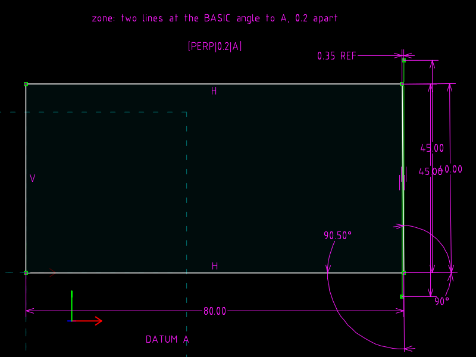
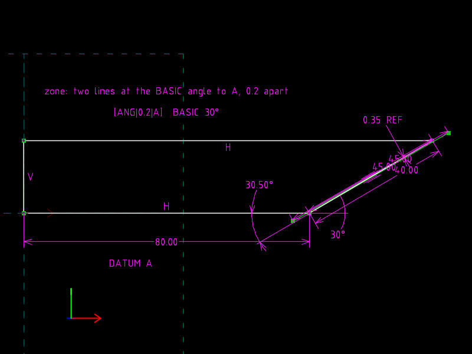
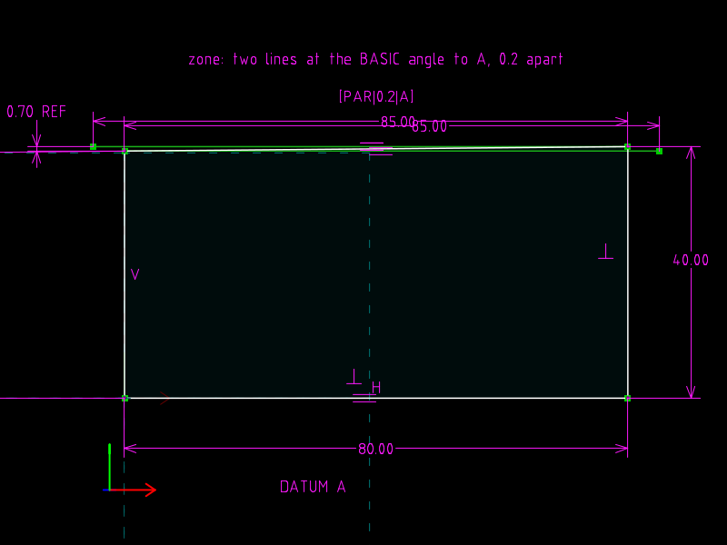

# 13 · Orientation: perpendicularity, angularity, parallelism

**GD&T says** (Cogorno ch. 6 *Orientation*): the tolerance zone is two
parallel planes (lines, in a view) at the **basic** angle to the datum,
spaced by the tolerance; the feature must fit between them.  The three
controls differ only in the basic angle: 90°, some other angle, 0°.

**The file models** a wedge-shaped block on datum A, one edge of which is
the toleranced feature, made 0.5° off its basic angle.  The zone is two
construction lines at the basic angle, through the feature's two ends, and
a reference dimension reports how far the far end is from the near
boundary: the orientation error.

| `perpendicularity.slvs` | `angularity.slvs` | `parallelism.slvs` |
|---|---|---|
|  |  |  |

## The files

Same outline in all three: bottom edge `r4` (datum A, 80), right edge
`r5` (40 long), top edge `r6`, left edge `r7` (VERTICAL).

| file | toleranced feature | actual | zone boundary `r8` | expected error |
|---|---|---|---|---|
| perpendicularity | right edge `r5` | ANGLE 90.5° to A | ANGLE 90° to A | 40 · sin 0.5° = 0.3491 |
| angularity | right edge `r5` | ANGLE 30.5° | ANGLE 30° | 40 · sin 0.5° = 0.3491 |
| parallelism | top edge `r6` | ANGLE 0.5° (`other=1`) | `121` PARALLEL to A | 80 · tan 0.5° = 0.6981 |

Why PARALLEL and not ANGLE 0: SolveSpace's angle equation is built on the
cosine, whose derivative is zero at 0° and 180°, so the solver has no
gradient to follow there.  Use PARALLEL / PERPENDICULAR at those angles.

`r9` is the second boundary, PARALLEL to `r8` through the feature's other
end.  Constraint `12` is the reference PT_LINE_DISTANCE from that end to
`r8`.  Every feature control frame here says 0.2, so all three drawings
read **reject**; the check asserts that.

## What changes between the files

The three files were generated from one template: the basic angle, the
actual angle (basic + 0.5°), the constraint type at 0°, and the initial
guesses that follow the corners.  `diff perpendicularity.slvs
angularity.slvs` shows exactly those lines.

## Verified

| file | zone angle to A | feature angle | reference error |
|---|---|---|---|
| perpendicularity | 90.000000° | 90.5° | 0.349061 |
| angularity | 30.000000° | 30.5° | 0.349061 |
| parallelism | 0.000000° | 0.5° | 0.698149 |

## What the file cannot say

Nothing here is a *tolerance*: the 0.2 lives in a COMMENT.  The zone is
two lines the author drew at the basic angle; the format guarantees they
stay at that angle and re-solve when the feature moves, and that is all.
