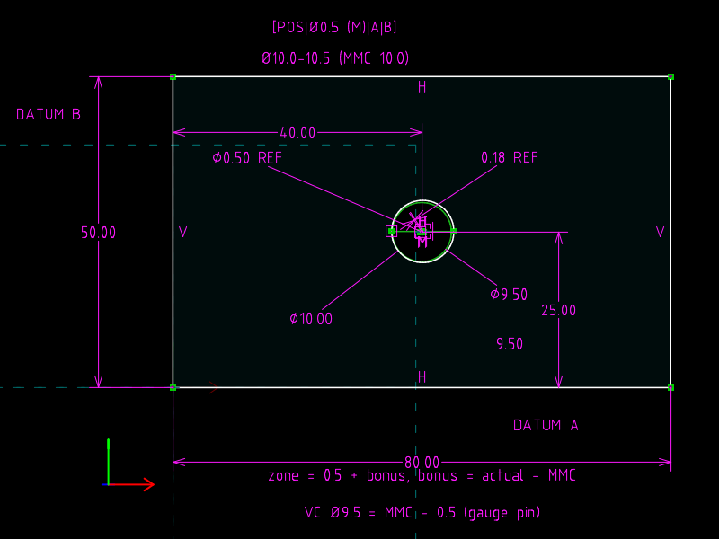

# 14 · Position at MMC: bonus tolerance and virtual condition

**GD&T says** (Cogorno ch. 7 *Position, General*): a hole's position
tolerance is a cylindrical zone Ø0.5 centred on the **true position**,
which is located by **basic** dimensions from the datums.  With the
Ⓜ modifier the zone grows by the **bonus**: the amount the actual hole
size departs from MMC.  The **virtual condition** Ø(MMC − tolerance) is the
boundary a functional gauge pin must pass through.

**The file models** the plate, the true position, the measured hole
(size and centre), the growing zone, and the gauge pin.  The bonus rule is
a constraint, not a number: change the measured size and the zone re-solves.

| `hole.slvs` (measured Ø10.2, zone Ø0.7) | `hole.mmc.slvs` (Ø10.0 = MMC, zone Ø0.5) |
|---|---|
|  |  |

## The file

| Request | Role |
|---|---|
| `r4`…`r7` | plate 80 × 50; bottom = datum A, left = datum B |
| `r8` circle (construction) | **tolerance zone** at true position: centre `080001` located by `32` PT_LINE_DISTANCE −40 from B and −25 from A (basic dimensions) |
| `r9` circle | **actual hole**: `90` DIAMETER 10.2 (measured size), centre `090001` pinned by `200` WHERE_DRAGGED at the measured (40.15, 25.10) |
| `r10` `Lh`, `r11` `Lz` (construction) | diameter lines across the hole and across the zone: HORIZONTAL, one end `100` PT_ON_CIRCLE, centre `70` AT_MIDPOINT, so \|Lh\| = hole Ø and \|Lz\| = zone Ø |
| `16` | `56` LENGTH_DIFFERENCE `Lz − Lh = −9.5`, i.e. **zone = 0.5 + (actual − 10.0)**: the bonus rule as one equation |
| `r12` circle (construction) | **virtual condition** gauge: concentric with the zone, `90` DIAMETER 9.5 = MMC − 0.5 |
| `19`, `1a` | reference PT_PT_DISTANCE true position ↔ actual centre (radial deviation), reference DIAMETER of the zone |

Only one endpoint of each diameter line sits on its circle: the midpoint
constraint already puts the other end there, and a second PT_ON_CIRCLE
would be redundant, which SolveSpace refuses.

## The one-line change

```diff
-Constraint.valA=10.20000000000000000000
+Constraint.valA=10.00000000000000000000
```

## Verified

| | measured Ø | bonus | zone Ø (written back) | deviation Ø (2 × 0.1803) | verdict |
|---|---|---|---|---|---|
| `hole.slvs` | 10.2 | 0.2 | 0.70 | 0.3606 | accept, margin 0.34 |
| `hole.mmc.slvs` | 10.0 | 0.0 | 0.50 | 0.3606 | accept, margin 0.14 |

Gauge: deviation + 9.5/2 = 4.93 ≤ actual radius (5.1 and 5.0): the Ø9.5
pin passes in both cases.  The zone radius solves to 0.35 from an initial
guess that was not 0.35.

## What the file cannot say

The Ⓜ is text.  SolveSpace has no material-condition semantics; the bonus
rule had to be written out as a length difference between two construction
lines, which is honest but also the limit of what a constraint solver can
do without a tolerance model.
