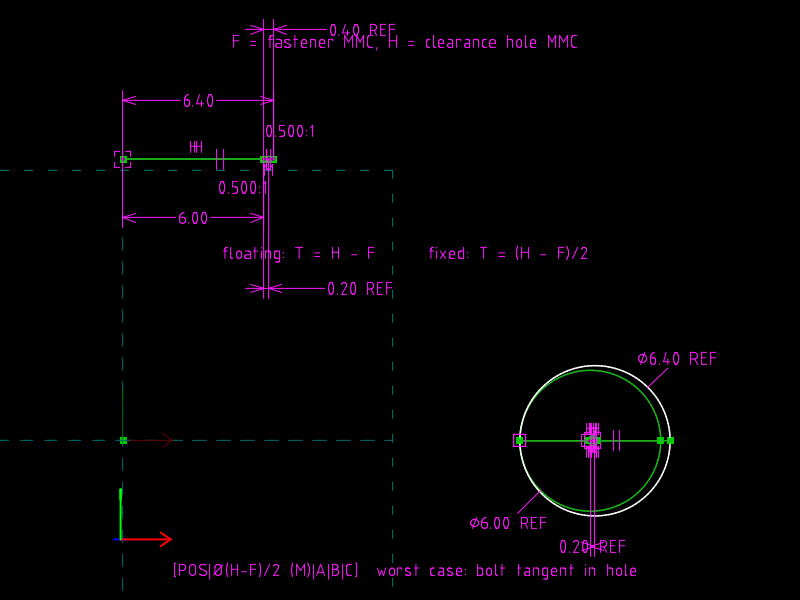
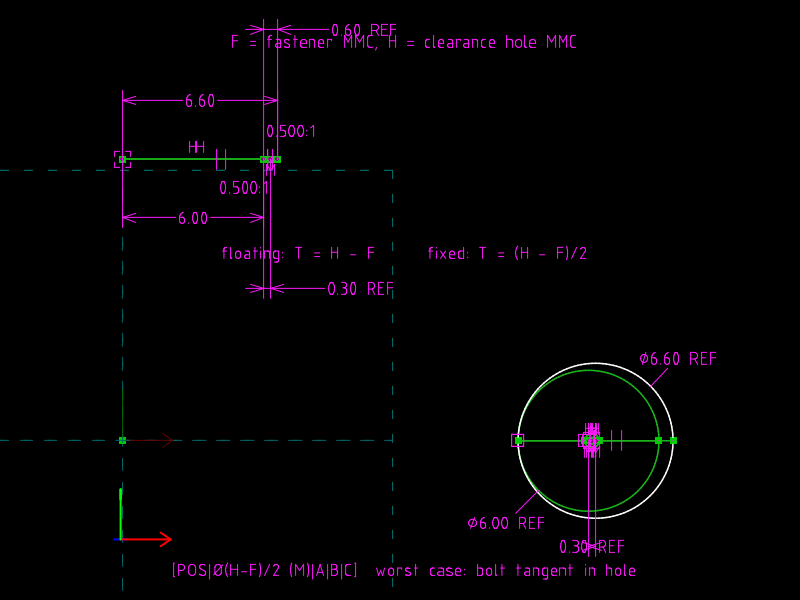

# 15 · Fixed and floating fasteners

**GD&T says** (Cogorno ch. 8 *Position, Location*): with H the clearance
hole at MMC and F the fastener at MMC, two clearance-hole parts (floating
fastener) may each carry a position tolerance T = H − F; when one part
holds the fastener (tapped hole, press-fit pin: fixed fastener) each part
gets T = (H − F)/2.  At the worst case, both axes at their zone limit in
opposite directions, the bolt just touches the hole wall.

**The file models** that arithmetic as geometry.  No formula is typed in;
change H and the tolerances, the zones, the worst-case offsets and the
tangency all re-solve.

| `fastener.slvs` (H 6.4) | `fastener.h66.slvs` (H 6.6) |
|---|---|
|  |  |

## The file

**Calculator strip** (top, all construction):

| Request | Role |
|---|---|
| `r5` `LF` | from anchor P0, HORIZONTAL, `30` PT_PT_DISTANCE **6.0** = F |
| `r6` `LH` | from the same P0, HORIZONTAL, **6.4** = H |
| `r7` `LT` | from LF's end to LH's end: length is H − F with **no constraint of its own** |
| `r8` M, `r9` `LTf` | M `70` AT_MIDPOINT of LT; LTf from LF's end to M: length (H − F)/2 |
| `0d`, `0e` | reference PT_PT_DISTANCE on LT and LTf: the file states 0.40 and 0.20 |

**Worst case** (bottom): true position TP; zone circles whose diameters
are tied to LTf and LT by diameter lines (`50` EQUAL_LENGTH_LINES, same
trick as MWE 14); the clearance hole Ø tied to LH and the bolt Ø tied to
LF the same way; and two offset lines from TP to the hole centre and the
bolt centre with `51` LENGTH_RATIO 0.5 against LTf, pointing opposite
ways.  So each axis sits at T_fixed/2 from true position, and the centre
distance equals T_fixed = rH − rF: internal tangency.

## The one-line change

```diff
-Constraint.valA=6.40000000000000000000
+Constraint.valA=6.60000000000000000000
```

## Verified

| | H − F (floating) | (H − F)/2 (fixed) | offsets | centre distance | rH − rF |
|---|---|---|---|---|---|
| H 6.4 | 0.40 | 0.20 | ±0.10 | 0.20 | 0.20 |
| H 6.6 | 0.60 | 0.30 | ±0.15 | 0.30 | 0.30 |

Tangent within 1e-9 in both files.

## What the file cannot say

Which part is which, that the bolt is a fastener, that the tolerance
applies "at MMC": all of that is in the COMMENTs.  The equations, however,
are real, and they are the same ones the book derives on paper.
