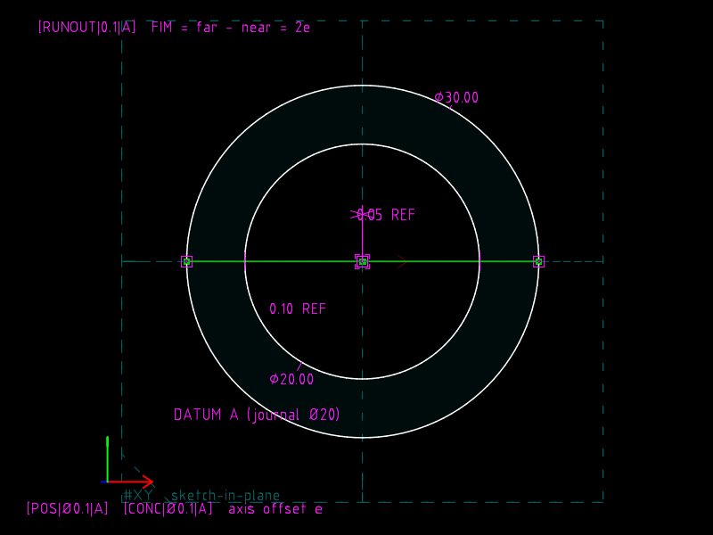
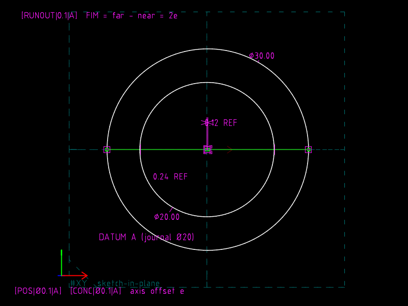
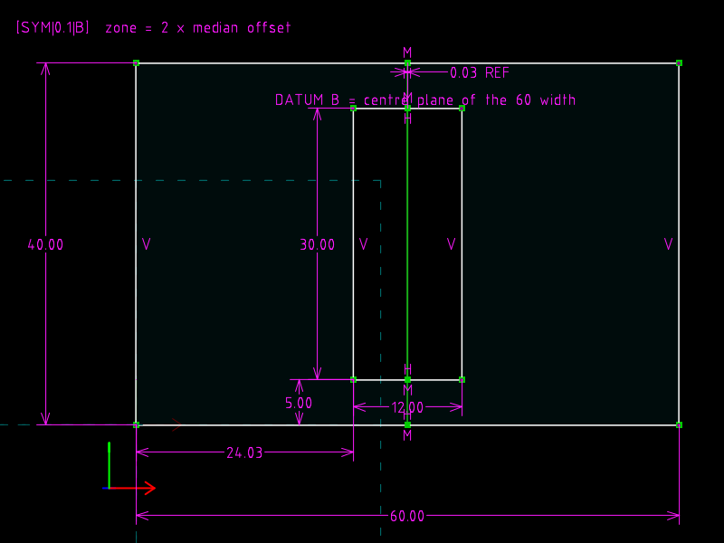
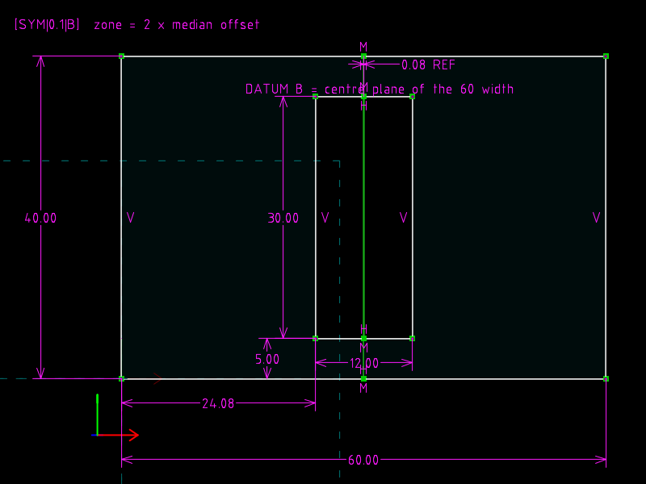

# 16 · Coaxiality, concentricity, runout, symmetry

**GD&T says** (Cogorno ch. 9 *Position, Coaxiality*, ch. 10
*Concentricity and Symmetry*, ch. 11 *Runout*): three controls can hold a
diameter to a datum axis.  Position (RFS) puts the feature *axis* in a
cylindrical zone; concentricity puts the feature's *median points* there;
circular runout limits the *full indicator movement* as the part turns.
For a perfectly round, eccentric feature all three give the same reading,
and the book's comparison is about where they diverge.  Symmetry is the
same idea for a slot about a centre plane.

| `runout.slvs` (e 0.05) | `runout.e12.slvs` (e 0.12) |
|---|---|
|  |  |

| `symmetry.slvs` (median 0.03 off) | `symmetry.off08.slvs` (0.08 off) |
|---|---|
|  |  |

## `runout.slvs`

End view of a shaft.  `r4` datum journal Ø20 at the origin; `r5` the
controlled Ø30 whose centre is *measured* 0.05 off axis (WHERE_DRAGGED).
`r6` is a construction line through both centres, both ends `100`
PT_ON_CIRCLE of the feature: the line of an indicator sweep.  `r7` and
`r8` run from the datum centre to those two points; constraint `0d` is a
**reference LENGTH_DIFFERENCE** between them: far − near = the FIM.
Constraint `0e` is the reference axis offset e.

| | axis offset e | runout FIM = 2e | position / concentricity zone Ø |
|---|---|---|---|
| `runout.slvs` | 0.05 | 0.10 | 0.10 |
| `runout.e12.slvs` | 0.12 | 0.24 | 0.24 |

Against `[RUNOUT|0.1|A]` the first is at the limit; the second rejects.
A lobed (out-of-round) feature would separate the three readings; that
needs measured form data, which this file does not carry.

## `symmetry.slvs`

Plate 60 × 40; datum B is the *centre plane of the width*, modelled as a
construction line `r8` whose ends are `70` AT_MIDPOINT of the bottom and
top edges (two midpoints = four equations = the line, no VERTICAL needed).
A 12 × 30 slot sits at a measured 24.03 from the left edge; its median
line `r13` joins the midpoints of its short edges.  Constraint `1c`
reports the median offset from B as a reference PT_LINE_DISTANCE.

| | slot left edge | median x | offset | symmetry zone needed | `[SYM|0.1|B]` |
|---|---|---|---|---|---|
| `symmetry.slvs` | 24.03 | 30.03 | 0.03 | 0.06 | accept |
| `symmetry.off08.slvs` | 24.08 | 30.08 | 0.08 | 0.16 | reject |

## The one-line changes

```diff
-Param.val=0.05000000000000000000          (runout: measured eccentricity)
+Param.val=0.12000000000000000000
-Constraint.valA=-24.03000000000000000000  (symmetry: measured slot position)
+Constraint.valA=-24.08000000000000000000
```

## What the file cannot say

"Datum axis A–B established from two journals", "median points",
"indicator": vocabulary the format lacks.  What it has is the arithmetic
of the readings, and a LENGTH_DIFFERENCE that can be a *reference*, so the
file itself reports the indicator movement.
