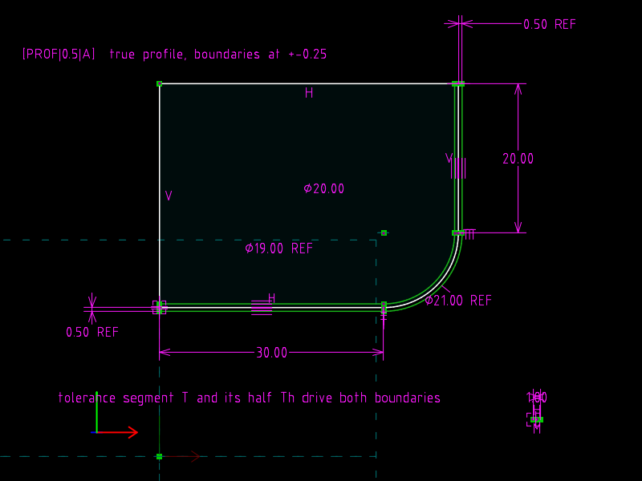

# 17 · Profile of a surface

**GD&T says** (Cogorno ch. 12 *Profile*): a profile tolerance defines a
zone bounded by two curves offset from the **true profile** (drawn with
basic dimensions), bilaterally by tol/2 unless shown otherwise.  The offset
of a tangent-continuous profile is itself tangent-continuous: parallel
lines and concentric arcs.

**The file models** a line–arc–line profile and both boundaries, driven by
one tolerance number.  The boundaries are not drawn at ±0.25; they are
*constrained* to be tol/2 from the true profile.

| `profile.slvs` (0.5) | `profile.tol1.slvs` (1.0) |
|---|---|
|  |  |

## The file

**True profile** (`r4` line 30 long, `r5` arc R10 tangent at both ends,
`r6` line 20 long, closed into a part by `r16`, `r17`).

**Tolerance as geometry:** `r7` is a construction line of length **0.5**
(the only tolerance number in the file); `r8` is its `70` AT_MIDPOINT;
`r9` `Th` runs from `r7`'s start to that midpoint, so \|Th\| = 0.25 with
no number of its own.

**Each boundary** is a line, an arc and a line (construction):

| Constraint | Meaning |
|---|---|
| `121` PARALLEL | boundary line ∥ its nominal line |
| `52` EQ_LEN_PT_LINE_D (`Th`, boundary start, nominal line) | boundary is \|Th\| away from the nominal, sign chosen by the initial guess |
| `81`/`80` point pairs | boundary lines span the same extent as the nominal |
| `20` centre coincident | boundary arc concentric with the nominal arc |
| `123` ARC_LINE_TANGENT × 2 | boundary arc tangent to *both* boundary lines |

The second leg carries **no** offset constraint: concentricity plus the two
tangencies already force the arc radius to R ± 0.25 and hence the second
line to 0.25 off.  (The first attempt used a second offset constraint and
dropped the second tangency instead.  That system has the same count of
equations, but the vertical line then meets the circle at a double root,
the Jacobian is singular there, and the solver left the geometry at its
initial guess.  Redundancy and degeneracy are different failures; the file
records the working choice.)

Reference dimensions: DIAMETER of both arcs (`25`, `26`) and the offset
of each straight leg (`27`, `2a`).

## The one-line change

```diff
-Constraint.valA=0.50000000000000000000
+Constraint.valA=1.00000000000000000000
```

## Verified

| | straight legs at | arc diameters | offsets written back |
|---|---|---|---|
| tol 0.5 | y = 19.75 / 20.25, x = 40.25 / 39.75 | 20.5 / 19.5 | 0.25, 0.25 |
| tol 1.0 | y = 19.5 / 20.5, x = 40.5 / 39.5 | 21.0 / 19.0 | 0.5, 0.5 |

## What the file cannot say

That the zone is a *tolerance*, that it is bilateral, that it applies to
"all around": text.  Composite profile, coplanarity and conical profile
(also ch. 12) are further constructions of the same kind and are not
included.
