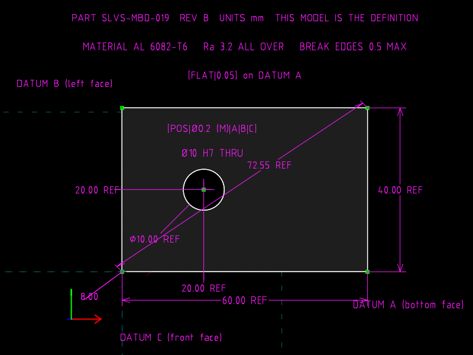
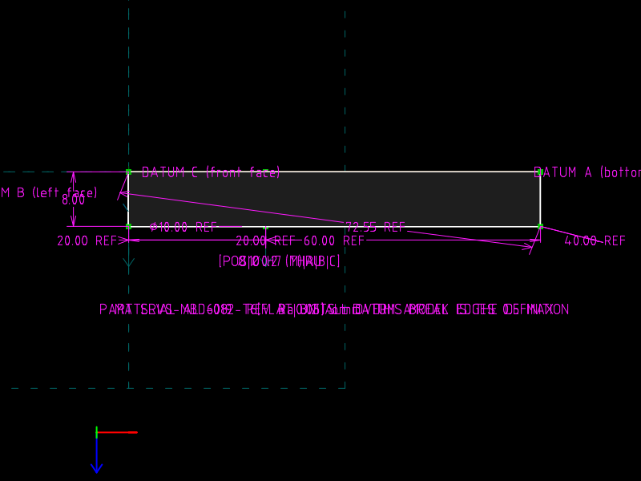
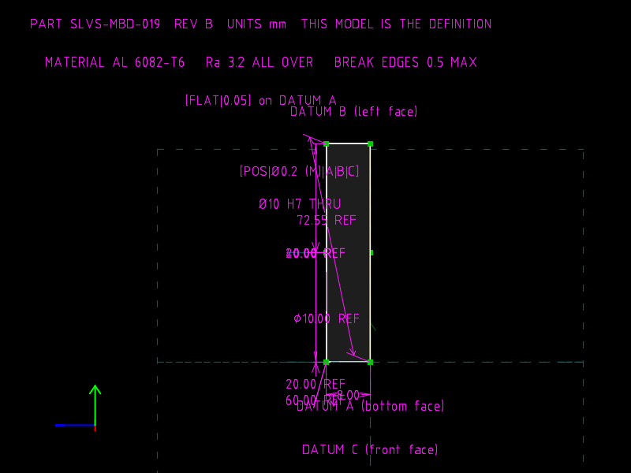

# 19 · Model-based definition and PMI

**MBD says:** the 3D model is the released definition of the part.  There
is no authored drawing; views are *derived* from the model on demand.
**PMI** (product and manufacturing information) is everything a drawing
used to carry, dimensions, tolerances, datums, notes, material, finish,
attached to the model's geometry so it travels with it and cannot drift
from it.

**The file models** a plate with one hole as a single `.slvs` dataset
that holds the geometry, the driving dimensions, 3D dimensions and notes
anchored to model points, datum labels, a feature control frame, material,
finish and revision.  From that one file the CLI derives front, top, right
and isometric views, a DXF, a STEP B-rep and an STL, and a small tool
reads the PMI back out as JSON.  Change the thickness in one line and every
derived artefact and every PMI value follows.

| `plate.slvs` (t = 8) | `plate.t12.slvs` (t = 12) |
|---|---|
|  |  |

Derived views of the same file, nothing drawn by hand:

| front | top | right |
|---|---|---|
|  |  |  |

## The file

| Group | Contents |
|---|---|
| `2` `plate-profile` | 60 × 40 outline, Ø10 hole at basic (20, 20) from the left and bottom edges: the **driving** size PMI |
| `3` `plate-body` | one-sided EXTRUDE; everything below lives here, in 3D, attached to the solid |

3D PMI in the extrude group (no `Constraint.workplane`, so 3D):

| Constraint | Kind | Attached to |
|---|---|---|
| `0f` | `30` PT_PT_DISTANCE **8**, driving | origin corner and its extruded copy `80030005`: the thickness |
| `10` | `30`, reference | origin corner and the far top corner `8003000f`: space diagonal, measured |
| `19`–`1d` | `30` / `90` / `32`, reference | width, height, hole Ø, hole-to-datum-B, hole-to-datum-C, **measured on the top face** |
| `11`–`13` | `1000` COMMENT with `ptA` | `DATUM A/B/C`, anchored to corner points of the bottom, left and front faces |
| `14`, `15` | `1000` with `ptA=8003002a` | `Ø10 H7 THRU` and `[POS|Ø0.2 (M)|A|B|C]`, anchored to the hole axis on the top face |
| `16`–`18` | `1000`, free | part number and revision, material and finish, `[FLAT|0.05] on DATUM A` |

`ptA` on a COMMENT makes it associative: `drawconstraint.cpp` places the
label at the anchor point plus `disp.offset`, so when the plate gets
thicker the hole callout rides up with the top face (the check reads the
anchor's solved position out of the PMI JSON).

The 3D reference dimensions deliberately repeat the sketch's driving
values.  In a drawing the two could disagree; here they cannot, because
the references are measured from the solved model.  They are also the
only size PMI visible in the 3D views: SolveSpace draws the constraints
of the *active* (last) group, so the sketch's own dimensions appear only in
the sketch.

## PMI as data

`tools/pmi.py` reads a regenerated file and emits [`out/plate.pmi.json`](out/plate.pmi.json):
every dimension with its type, value, driving/reference flag, 2D/3D flag
and the solved coordinates of the points it attaches to; every note with
its text and anchor; datums separately.  A downstream consumer gets the
numbers without parsing `.slvs` or reading a drawing.

## The one-line change

```diff
-Constraint.valA=8.00000000000000000000
+Constraint.valA=12.00000000000000000000
```

## Verified

| | thickness PMI | STL thickness | space diagonal (ref) | hole callout anchor | PMI values that changed |
|---|---|---|---|---|---|
| `plate.slvs` | 8 | 8 | 72.553 = √(60²+40²+8²) | (20, 20, 8) | |
| `plate.t12.slvs` | 12 | 12 | 73.103 | (20, 20, 12) | thickness, diagonal, nothing else |

Every 3D reference equals its driving counterpart in both files.

## What travels, measured

| Carrier | Geometry | Dimensions | Notes / datums / FCF |
|---|---|---|---|
| `.slvs` | ✓ | ✓ driving and reference | ✓ as COMMENT, anchored |
| `pmi.json` (this repo's tool) | points only | ✓ | ✓ |
| DXF (`export-view`) | ✓ | ✓ `DIMENSION` entities | ✓ `TEXT` entities, Unicode intact |
| SVG / PNG views | ✓ | ✓ as drawn text | ✓ as drawn text (built-in font, no GD&T glyphs) |
| STEP (`export-surfaces`) | ✓ AP203 B-rep | **none** | **none** |
| STL | facets | none | none |

The STEP file declares `CONFIG_CONTROL_DESIGN` (AP203) and contains zero
`DRAUGHTING`, `GEOMETRIC_TOLERANCE`, `DIMENSIONAL_SIZE`, `DATUM` or
`ANNOTATION` entities.  **Semantic PMI in STEP AP242, the industrial MBD
exchange, is not something SolveSpace can write.**  What it offers instead
is a text dataset in which the PMI is *already* structured data.

## What the file cannot say

There is no tolerance object, so `H7`, `Ø0.2 (M)` and `Ra 3.2` are text.
There is no unit, revision, part-number or material field in the format;
they are notes by convention.  3D notes are planar objects with no
annotation plane of their own, so in an edge-on derived view (the right
view above) they collapse onto one another, which is exactly why MBD
viewers manage annotation planes explicitly.
