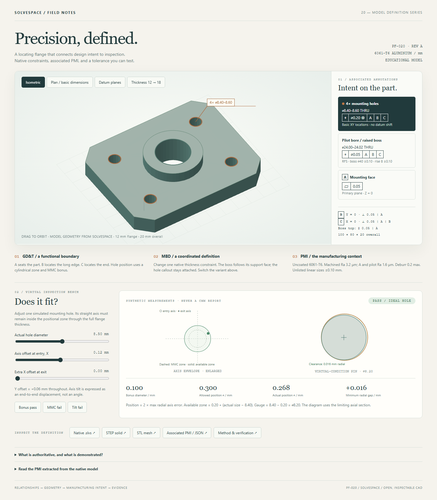

# 20 · Precision, defined

A native locating flange connects **GD&T, model-based definition and PMI**
in one inspectable example. Change one thickness constraint: the mounting
flange grows, its integral boss follows, and the position callout remains
attached to its hole. Then test the difference between a nominal model and
a toleranced manufactured feature at the virtual inspection bench.

[](out/review.html)

**Open [out/review.html](out/review.html) locally.** Drag to orbit the actual
SolveSpace STL; select the pilot, hole pattern or mounting face; show the
datum planes; switch to the plan view; change thickness. Try **MMC fail**,
then **Bonus pass**, then **Tilt fail**. The standalone page has no CDN,
network requests or server dependency. Its 3D view requires WebGL.
GitHub displays HTML source, so download the checkout before opening it.

## The definition

This is an original educational fixture interface, not a production release.
All dimensions are millimetres.

| Feature | Nominal model | Manufacturing intent |
|---|---|---|
| Flange | 100 × 80 × 12, four 10 × 10 corner clips | Unlisted linear dimensions ±0.10 |
| Integral boss | Ø40, rises 8 above the flange | Ø40 ±0.10; top parallelism 0.05 to A |
| Pilot bore | Ø24, through flange and boss; basic XY (50,40) | Ø24.00–24.02; position Ø0.05 at RFS to A–B–C |
| Four mounting bores | Ø8.40; basic XY (18,18), (82,18), (82,62), (18,62) | Ø8.40–8.60; position Ø0.20 at MMC to A–B–C |
| Datum feature A | Mounting face, Z=0 | Primary; flatness 0.05 |
| Datum feature B | Long planar side, Y=0 | Secondary; perpendicularity 0.05 to A |
| Datum feature C | End planar side, X=0 | Tertiary; perpendicularity 0.05 to A–B |
| Material and finish | 6061-T6 aluminium, uncoated | Machined Ra 3.2 µm; A and pilot Ra 1.6 µm; deburr 0.2 max |

The rectangular planar datum system seats the part on A, locates it against
B, and stops it against C. It constrains 3 + 2 + 1 rigid-body freedoms.
The pilot is a controlled feature, **not datum B**. No datum feature of size
is referenced, and no datum shift is claimed. The plan view's boxed XY pairs
are a review aid for basic coordinates, not conventional ordinate dimensions.

The outline and nominal XY centres use fixed native points. Diameter,
equal-radius relations, boss concentricity and extrusion thicknesses are
native constraints. The example does not claim a fully dimension-driven
outline or a parametric bolt-pattern feature.

## One line, two genuinely solved solids

[flange.slvs](flange.slvs) and [flange.t18.slvs](flange.t18.slvs) differ in
exactly one line, belonging to constraint `0000001b`:

```diff
-Constraint.valA=12
+Constraint.valA=18
```

The initial extrusion parameter is deliberately wrong in both sources.
SolveSpace regenerates it from the driving dimension. The boss sketch
origin references the base extrusion's generated pilot centre, so the
boss moves with the flange rather than using a second absolute Z value.
COMMENT `00000024` references a generated mounting-hole centre on the top
face, so its anchor moves from (82,18,12) to (82,18,18).

| Independent measurement | 12 mm flange | 18 mm flange |
|---|---:|---:|
| Total height | 20 | 26 |
| Valid STEP solids | 1 | 1 |
| Exact volume, mm³ | 91945.260318 | 134700.899599 |
| Reopened STEP volume, mm³ | 91945.260292 | 134700.899510 |
| Bore inside/outside probes | 240 | 240 |
| STL closed / Euler characteristic | yes / −8 | yes / −8 |

The reference volume is derived independently:

`V = (100*80 - 4*10*10/2 - pi*(12² + 4*4.2²))*t + pi*(20²-12²)*8`.

The STEP volume gate is 0.05 mm³, allowing spline integration error in the
export; measured errors are below 0.0001 mm³. STL volume differs by about
0.1%, consistent with tessellation; its gate is 0.3%. Closed topology and
five bore boundaries are checked separately, so a matching volume alone
cannot certify the shape. A missing triangle must fail watertightness,
and solid web material must reject a bore claim.

## What the inspection bench proves

For each mounting hole, MMC = Ø8.40 and LMC = Ø8.60. The specified position
tolerance is Ø0.20 at MMC; the fixed virtual-condition pin is Ø8.20.

- Bonus = actual hole size − 8.40.
- Available position diameter = 0.20 + bonus.
- Actual position diameter = twice the maximum radial axis displacement
  from the basic position through the flange thickness.
- For the ideal circular-section model, minimum radial pin gap =
  (actual hole diameter − 8.20)/2 − maximum radial displacement.

| Synthetic case | Hole Ø | Entry XY error | Exit XY error | Actual position Ø | Allowed Ø | Result |
|---|---:|---|---|---:|---:|---|
| MMC | 8.40 | (0.12, 0.06) | (0.12, 0.06) | 0.268328 | 0.200 | FAIL |
| With bonus | 8.50 | (0.12, 0.06) | (0.12, 0.06) | 0.268328 | 0.300 | PASS |
| Tilted axis | 8.50 | (0.12, 0.06) | (0.18, 0.06) | 0.379473 | 0.300 | FAIL |

The straight-axis endpoint test covers the entire axis segment because a
cylindrical tolerance zone is convex. Checking only the entry end would
incorrectly accept the tilted case. There are also undersize, oversize,
boundary and nonfinite controls. A 36-case parameter grid compares the
axis result against pin containment sampled at 101 axial stations.

**Scope of this calculation:** ideal datum planes, a straight extracted
axis, and circular hole sections in planes parallel to A. The tilted case
is a section-envelope teaching model; it does not compute the elliptical
sections of an obliquely drilled perfect cylinder. Real hole form, datum
establishment, Rule 1 envelope inspection, roughness, measurement
uncertainty and whole-pattern simultaneous gaging are outside the check.
The actual CAD remains nominal while these explicitly synthetic measurements
change. No generated PASS is evidence that a physical part conforms.

## MBD and PMI, without pretending to have AP242

The native `.slvs` owns nominal geometry and the textual requirements.
`tools/pmi.py` extracts its notes, datums, dimensions and anchor coordinates.
`associations.json` names native entities; `_build/present.py` derives the
review, embeds the actual STL triangles, and writes `out/definition.json`
with SHA-256 identities for each source and native/STEP/STL export.
The MMC calculation reads its numbers from the native position callout.

This is an **associated educational definition package**. Native COMMENT
records do not have standardized GD&T semantics. The STEP exporter writes
AP203 `CONFIG_CONTROL_DESIGN` geometry, not AP242 semantic PMI. The JSON is
a documented local representation, not a STEP standard or a PLM schema.
No Y14.41 conformance, release approval or machining feasibility is certified.
ASME treats digital product definition in
[Y14.41](https://www.asme.org/codes-standards/find-codes-standards/y14-41-digital-product-definition-data-practices)
and model organization in
[Y14.47](https://www.asme.org/codes-standards/find-codes-standards/y1447-2019-model-organization-practices).

## Reproduce

From the repository root, on any platform with Python and SolveSpace CLI:

```text
python tools/build.py --cli PATH_TO_SOLVESPACE_CLI --only 20
python mwe/20_precision_flange/_build/present.py
python tools/check.py --only 20
python -m unittest discover -s tests
```

`present.py` must run after the shared builder because the definition hashes
bind the newly generated exports. The source files are shipped; to reauthor
them from the readable record composer, run this **before** the commands above:

```text
python mwe/20_precision_flange/_build/author.py --cli PATH_TO_SOLVESPACE_CLI
```

Independent solid verification needs CadQuery/OpenCascade and the existing
[stl_inspect.py](https://github.com/Foadsf/dev-scripts/blob/main/stl_inspect.py).
Browser QA needs Playwright with Chromium:

```text
python mwe/20_precision_flange/_build/verify.py --stl-inspector PATH_TO_STL_INSPECT_PY
python mwe/20_precision_flange/_build/qa.py
```

Evidence: [native and synthetic checks](out/inspection-evidence.json),
[independent STEP/STL checks](out/solid-evidence.json), and
[browser interactions](out/browser-evidence.json).
Screenshots cover [datums](out/qa-datums.png), [plan](out/qa-plan.png),
and [390 px mobile layout](out/qa-mobile.png). Visual inspection caught and
removed a painter-order artifact; the final viewer uses a WebGL depth buffer.
All eight shared unit tests and the new example's checks passed.

## Reference and native-format provenance

The supplied Cogorno PDF was converted locally and consulted, not uploaded
or copied into the repository. Its copyright page identifies the **2006**
edition, based on ASME Y14.5M-1994:

- Chapter 4, printed pp. 48–49 (PDF pp. 62–63): planar datum frame,
  immobilization and order of precedence.
- Chapter 7, printed pp. 108–110 (PDF pp. 122–124): MMC bonus,
  positional tolerance and the virtual-condition functional pin, Fig. 7-6.

The flange, dimensions, browser illustrations and synthetic examples are
original; no book figures or extracted pages are distributed. This is a
teaching application of those principles, not a claim that the 1994 edition
is the current standard.

Native format fields and enums follow SolveSpace `8f4b12ca`:

- [file.cpp, saved-field table](https://github.com/solvespace/solvespace/blob/8f4b12ca/src/file.cpp#L89-L213).
- [sketch.h, constraints](https://github.com/solvespace/solvespace/blob/8f4b12ca/src/sketch.h#L659-L698).
- [group.cpp, workplane and extrusion generation](https://github.com/solvespace/solvespace/blob/8f4b12ca/src/group.cpp#L447-L542).
- [file.cpp, remap serialization](https://github.com/solvespace/solvespace/blob/8f4b12ca/src/file.cpp#L258-L268):
  remap index and copy number are **decimal**; the source entity is hex.
  The authoring helper bootstraps regeneration to discover these handles.

Tested on Windows with SolveSpace CLI `3.2~8f4b12ca`. All geometry exports
come from the native solver. No external model or image generator authored
the CAD, annotations, or preview.
